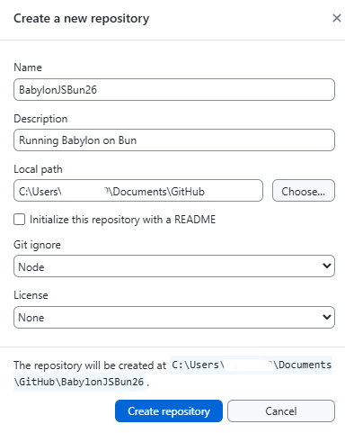
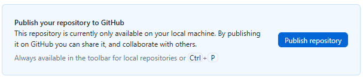
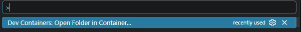
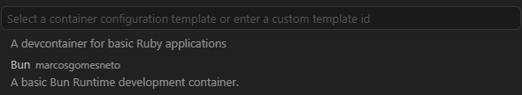

# BabylonJS on Bun

[Bun](https://bun.sh/) is a fast javascript package manager which also has a test server and a bundler.

Bun also transpiles TypeScript without the need to separately install it.  However for full features of typescript 

For basic BabylonJS projects this should provide most of the required support.

## Setting up a docker development environment

Make sure that Docker is running first.  This is tested on docker version 4.7.8.

Visual studio must have the Devcontainers plugin installed.

Using github desktop set up a github repository named BabylonJSBun26

Use Node as the gitnore entry.



Open a blank VSCode window

Publish this to Github



Open in VSCod then:

>  CTRL + SHIFT + P

Find the new repository on the local machine opening this in a container.




As this is a new container Visual studio code starts a dialogue.

Add the configuration to the workspace.  This will mean thea the workspace can be easily restored on other machines after downloading a copy from gitHub.


Show all configuration options to find Bun



The debian version will do fine.


Press ok without adding any further features.


Wait while the container is populated, the initial directory structure is:


Now open a terminal and add in babylon elements and typescript.

> bun add @babylonjs/core @babylonjs/loaders @babylonjs/inspector @babylonjs/havok

Wait for the installing process to complete.

```bash
bun add v1.3.14 (0d9b296a)

installed @babylonjs/core@9.13.0
installed @babylonjs/loaders@9.13.0
installed @babylonjs/inspector@9.13.0 with binaries:
 - babylon-inspector
installed @babylonjs/havok@1.3.12

109 packages installed [202.52s]
```

> bun add -d typescript

```bash
bun add v1.3.14 (0d9b296a)

installed typescript@6.0.3 with binaries:
 - tsc
 - tsserver

1 package installed [1492.00ms]
```

That is a good point to commit files to the BabylonJSBun repository and puplish to github.


ChatGPT says:

````markdown
# Babylon.js + Bun (Without Vite)

You can use **Bun's built-in bundler** directly with **Babylon.js** and skip Vite entirely. Babylon.js is distributed as ES modules, so Bun can bundle it much like it bundles any other modern JavaScript dependency.

## 1. Create a Project

```bash
mkdir bun-babylon
cd bun-babylon

bun init
```

Install Babylon.js:

```bash
bun add @babylonjs/core
```

If you want loaders, GUI, physics, etc.:

```bash
bun add @babylonjs/loaders @babylonjs/gui
```

---

## 2. Project Structure

```text
bun-babylon/
├── src/
│   └── main.ts
├── public/
│   └── index.html
└── bunfig.toml
```

---

## 3. Create a Babylon Scene

### `src/main.ts`

```ts
import {
    Engine,
    Scene,
    ArcRotateCamera,
    Vector3,
    HemisphericLight,
    MeshBuilder
} from "@babylonjs/core";

const canvas = document.getElementById("renderCanvas") as HTMLCanvasElement;

const engine = new Engine(canvas, true);
const scene = new Scene(engine);

const camera = new ArcRotateCamera(
    "camera",
    Math.PI / 2,
    Math.PI / 3,
    5,
    Vector3.Zero(),
    scene
);

camera.attachControl(canvas, true);

new HemisphericLight(
    "light",
    new Vector3(0, 1, 0),
    scene
);

MeshBuilder.CreateBox("box", {}, scene);

engine.runRenderLoop(() => {
    scene.render();
});

window.addEventListener("resize", () => {
    engine.resize();
});
```

---

## 4. Create an HTML File

### `public/index.html`

```html
<!DOCTYPE html>
<html>
<head>
    <meta charset="utf-8">
    <title>Babylon + Bun</title>
</head>
<body>
    <canvas
        id="renderCanvas"
        style="width:100vw;height:100vh;display:block;"
    ></canvas>

    <script src="./bundle.js"></script>
</body>
</html>
```

---

## 5. Bundle with Bun

Build manually:

```bash
bun build src/main.ts \
  --outdir public \
  --target browser
```

This generates:

```text
public/
├── bundle.js
└── index.html
```

---

## 6. Serve the Files

Using a simple static server:

```bash
bunx serve public
```

or

```bash
python -m http.server
```

Open:

```text
http://localhost:3000
```

(or whichever port your server uses)

---

## 7. Add Build Scripts

### `package.json`

```json
{
  "scripts": {
    "build": "bun build src/main.ts --outdir public --target browser",
    "dev": "bun build src/main.ts --outdir public --target browser --watch"
  }
}
```

Run:

```bash
bun run dev
```

---

## Asset Handling

For `.glb`, `.gltf`, textures, shaders, etc., keep them in a public folder:

```text
public/
├── models/
│   └── ship.glb
├── textures/
└── bundle.js
```

Load them using URLs:

```ts
import "@babylonjs/loaders";

SceneLoader.AppendAsync(
    "/models/",
    "ship.glb",
    scene
);
```

Since Bun's bundler is currently much more minimal than Vite's asset pipeline, many Babylon projects simply:

1. Bundle TypeScript with `bun build`
2. Serve static assets from `public/`
3. Reference assets by URL

---

## Using a Build Script Instead of the CLI

You can also use Bun's build API:

```ts
await Bun.build({
    entrypoints: ["src/main.ts"],
    outdir: "public",
    target: "browser",
    minify: true,
    sourcemap: "external"
});
```

Run:

```bash
bun run build.ts
```

This gives you more control over production builds without introducing Vite, Webpack, or Rollup.

---

## Summary

For a small-to-medium Babylon.js application, a simple setup of:

- `bun build` for bundling
- A static `public/` directory for assets
- URL-based asset loading

is often all you need, without adding Vite or another bundler.
````
