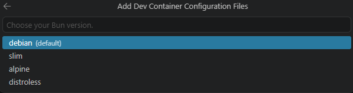
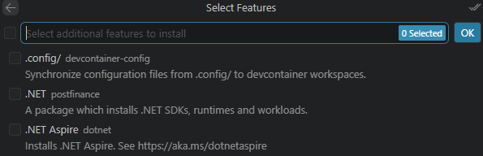
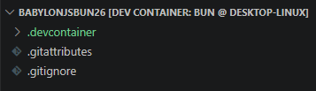
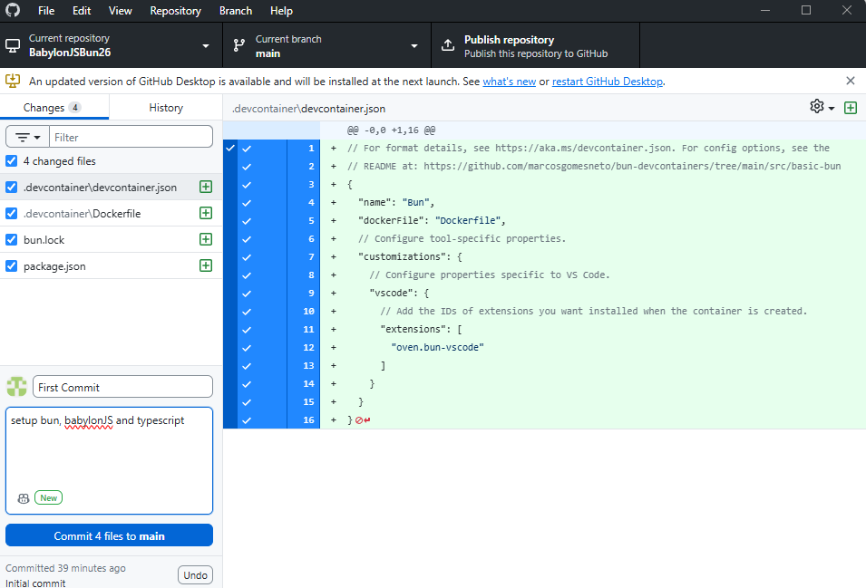
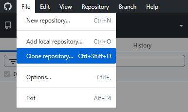

# BabylonJS on Bun

[Bun](https://bun.sh/) is a fast javascript package manager which also has a test server and a bundler.

Bun also transpiles TypeScript without the need to separately install it.  However typescript can be added to access its' full features. 

For basic BabylonJS projects this should provide most of the required support.

## Setting up a docker development environment

Make sure that Docker is running first.  This is tested on docker version 4.7.8.

Visual studio must have the Devcontainers plugin installed.

Using github desktop set up a github repository named BabylonJSBun26

Use Node as the gitnore entry.


Open a blank VSCode window

Publish this to Github


Open in VSCod then:

>  CTRL + SHIFT + P

Find the new repository on the local machine opening this in a container.


As this is a new container Visual studio code starts a dialogue.

Add the configuration to the workspace.  This will mean thea the workspace can be easily restored on other machines after downloading a copy from gitHub.


Show all configuration options to find Bun


The debian version will do fine.



Press ok without adding any further features.



Wait while the container is populated, the initial directory structure is:



Now open a terminal and add in babylon elements and typescript.

> bun add @babylonjs/core @babylonjs/loaders @babylonjs/inspector @babylonjs/havok

Wait for the installing process to complete.

```bash
bun add v1.3.14 (0d9b296a)

installed @babylonjs/core@9.13.0
installed @babylonjs/loaders@9.13.0
installed @babylonjs/inspector@9.13.0 with binaries:
 - babylon-inspector
installed @babylonjs/havok@1.3.12

109 packages installed [202.52s]
```

> bun add -d typescript

```bash
bun add v1.3.14 (0d9b296a)

installed typescript@6.0.3 with binaries:
 - tsc
 - tsserver

1 package installed [1492.00ms]
```

That is a good point to commit files to the BabylonJSBun repository and publish to github.




## Transferring machine

Work can be transferred to another machine using the github repository.

Have Docker running on the new machine.

If you move to another machine you can Use github desktop to clone the repository;



Open then in visual studio code and wait.  VSC will detect the .devcontainer folder and use this to open a docker container with the appropriate files.

The package.json file contains the details of all the installed software and these can be restored from the VSC terminal entering.

> bun install

```bash
bun install v1.3.14 (0d9b296a)

+ typescript@6.0.3
+ @babylonjs/core@9.13.0
+ @babylonjs/havok@1.3.12
+ @babylonjs/inspector@9.13.0
+ @babylonjs/loaders@9.13.0

110 packages installed [199.67s]
```

This is a general process which can be applied to running any repository you create.


