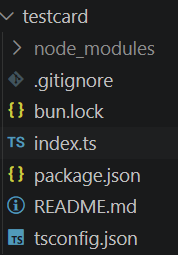
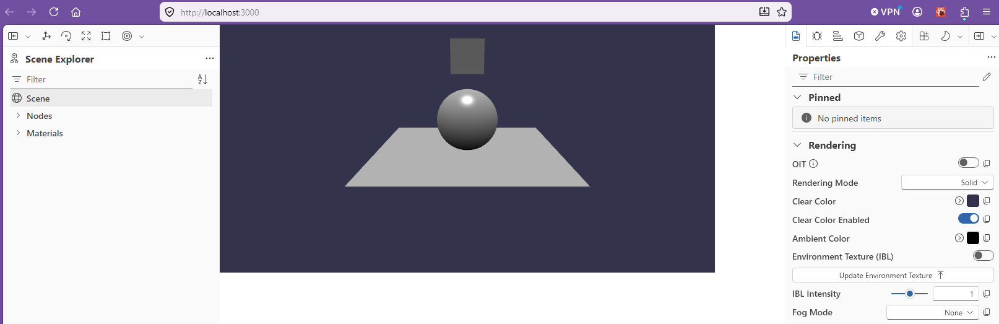
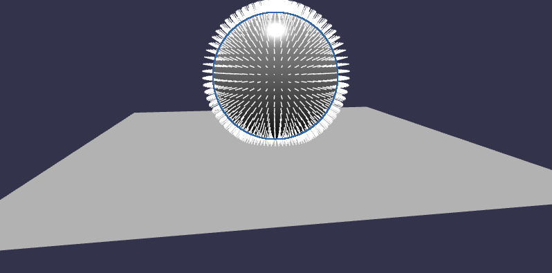
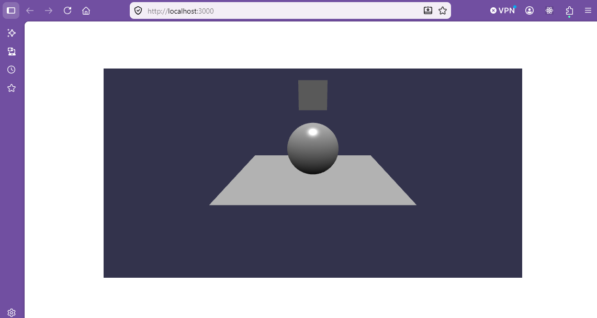

# Babylon Test Card

The babylon test card is just a simple 3D scene which can be used as a check that the system is working and as a placeholder for later developments.

A testcard project can be set up 


> mkdir testcard
> 
> cd testcard
> 
> bun init

The [bun init](https://bun.com/docs/runtime/templating/init#bun-init) command is used to scaffold a new project.  In this case we use a blank project template.

```bash
? Select a project template - Press return to submit.
❯   Blank
    React
    Library
```

Select Blank

```bash
To get started, run:

    bun run index.ts

bun install v1.3.14 (0d9b296a)

+ @types/bun@1.3.14
+ typescript@5.9.3 (v6.0.3 available)

5 packages installed [5.52s]
```

The testcard project directory is then set up.



Index.ts is the starting point and at the moment this is a simple "Hello from Bun" message.

## Creating the tescard scene

It is useful to separate the typescript code into modules so that file sizes are managable and code can be maintained.

Initiall we will start with two files, index.ts and createScene.ts and will extend this structure as scenes become more detailed.

The index.ts file will have the job of: 
* loading a babylonJS engine
* importing elements from other modules
* creating an HTML canvas where the scene can be rendered
* Apply positioning to the canvas
* drawing in the scene elements from createScene
* running a render loop which will keep displaying the scene frames as they change.
* display the scene inspector for debugging

**testcard/index.ts**
```typescript
import { Engine } from "@babylonjs/core";
import { createStartScene } from './createStartScene';
import { ShowInspector } from "@babylonjs/inspector";
import './main.css';

const CanvasName = "renderCanvas";

let canvas = document.createElement("canvas");
canvas.id = CanvasName;
canvas.width = 800;   // Set internal resolution
canvas.height = 400;

canvas.classList.add("background-canvas");
document.body.style.display = "flex";
document.body.style.justifyContent = "center"; // Horizontal centering
document.body.style.alignItems = "center";     // Vertical centering
document.body.style.minHeight = "100vh";       // Use full viewport height
document.body.style.margin = "0"; 
document.body.appendChild(canvas);

let eng = new Engine(canvas, true, {}, true);
let startScene = createStartScene(eng);
eng.runRenderLoop(() => {
    startScene.render();
});     
ShowInspector(startScene);
``` 
Add in createStartScene.  This has the task of:

* Importing the aspects of the Babylon core to be used in this module
* Defining functions for the creation of scene elements
* Creating a scene using the engine passed in from index.ts
* Call functions to add elements to the scene
* Return the scene

**testcard/createStartScene.ts**
```typescript
import {
    Engine,
    Scene,
    ArcRotateCamera,
    Vector3,
    HemisphericLight,
    MeshBuilder,
  } from "@babylonjs/core";
  
  
  function createBox(scene: Scene) {
    let box = MeshBuilder.CreateBox("box",{size: 1}, scene);
    box.position.y = 3;
    return box;
  }

  
  function createLight(scene: Scene) {
    const light = new HemisphericLight("light", new Vector3(0, 1, 0), scene);
    light.intensity = 0.7;
    return light;
  }
  
  function createSphere(scene: Scene) {
    let sphere = MeshBuilder.CreateSphere(
      "sphere",
      { diameter: 2, segments: 32 },
      scene,
    );
    sphere.position.y = 1;
    return sphere;
  }
  
  function createGround(scene: Scene) {
    let ground = MeshBuilder.CreateGround(
      "ground",
      { width: 6, height: 6 },
      scene,
    );
    return ground;
  }
  
  function createArcRotateCamera(scene: Scene) {
    let camAlpha = -Math.PI / 2,
      camBeta = Math.PI / 2.5,
      camDist = 10,
      camTarget = new Vector3(0, 0, 0);
    let camera = new ArcRotateCamera(
      "camera1",
      camAlpha,
      camBeta,
      camDist,
      camTarget,
      scene,
    );
    camera.attachControl(true);
    return camera;
  }
  
export function createStartScene(engine: Engine) {
    let myscene: Scene = new Scene(engine) ;
    createBox(myscene);
    createLight(myscene);
    createSphere(myscene);
    createGround(myscene);
    createArcRotateCamera(myscene);

    return myscene;
  }
  ```


Now create an html file in the the testcard directory which will call index.ts

**testcard/index.html**
```html
<!DOCTYPE html>
<html>
    <head>
        <base href="/testcard/">
        <meta charset="UTF-8">
        <title>Testcard</title>
    </head>
    <body> <div id="3d"></div> </body>
</html>
<script type="module" src="./index.ts"></script>
```

Finaly add some style which will be applied to the html page.

**testcard/main.css**
```css
body {
    overflow: hidden;
    width: 100%;
    height: 100%;
    margin: 0;
    padding: 0;
}
```

Typescript is not yet informed what a css file is so a declaration file should be created in the root of the file structure just to prevent typescript errors from being generated.

Typescript also does not recognise bun so before creating the declaration files

> bun add -d @types/bun

Now add the declaration file:

**declaration.d.ts**
```typescript
declare module "*.css" {
  const content: string;
  export default content;
}

declare module "bun" {
  function file(path: string): Promise<File>;
  export { file };
}
```

Update the tsconfig file so that typescript will read the declaration file.

**tsconfig.json**
```json
{
  "compilerOptions": {
    // Environment setup & latest features
    "lib": ["ESNext"],
    "target": "ESNext",
    "module": "Preserve",
    "moduleDetection": "force",
    "jsx": "react-jsx",
    "allowJs": true,
    "types": ["bun"],

    // Bundler mode
    "moduleResolution": "bundler",
    "allowImportingTsExtensions": true,
    "verbatimModuleSyntax": true,
    "noEmit": true,

    // Best practices
    "strict": true,
    "skipLibCheck": true,
    "noFallthroughCasesInSwitch": true,
    "noUncheckedIndexedAccess": true,
    "noImplicitOverride": true,

    // Some stricter flags (disabled by default)
    "noUnusedLocals": false,
    "noUnusedParameters": false,
    "noPropertyAccessFromIndexSignature": false
  },
  "include": [
  "**/*.ts",
  "**/*.tsx",
  "declarations.d.ts" 
  ]
}
```


A restart of the container by closing and reopening VSCode will enable typescript to pick up this declaration and the error on importing css will disappear.


## Run on bun server

To run this in the simple way an html file server must be provided which will provide a view of the output through the code development stages.  Add server.ts to the root directory.

**server.ts**
```typescript
import { file } from "bun";

const PORT = 3000;

// MIME type mapping
const mimeTypes: Record<string, string> = {
  ".ts": "application/javascript",
  ".js": "application/javascript",
  ".json": "application/json",
  ".html": "text/html",
  ".css": "text/css",
  ".png": "image/png",
  ".jpg": "image/jpeg",
  ".gif": "image/gif",
  ".svg": "image/svg+xml",
};

Bun.serve({
  port: PORT,
  async fetch(req) {
    const url = new URL(req.url);
    let path = url.pathname;

    if (path === "/") {
        path = "/testcard/index.html";
    }

    const filePath = `.${path}`;
    const targetFile = file(filePath);

    if (await targetFile.exists()) {
      // Get file extension
      const ext = path.substring(path.lastIndexOf("."));
      
      // Handle TypeScript transpilation for browser modules
      if (ext === ".ts") {
        const result = await Bun.build({
          entrypoints: [filePath],
          format: "esm",
        });
        
        if (!result.success) {
          return new Response(`Build error: ${result.logs.join('\n')}`, { status: 500 });
        }
        
        const transpiled = await result.outputs[0].text();
        
        return new Response(transpiled, {
          headers: { "Content-Type": "application/javascript" }
        });
      }
      
      // Serve other file types normally
      const contentType = mimeTypes[ext] || "application/octet-stream";
      return new Response(targetFile, {
        headers: { "Content-Type": contentType }
      });
    }

    return new Response("File not found", { status: 404 });
  },
});

console.log(`Babylon.js server running at http://localhost:${PORT}`);
```

Now start the bun server and let's see this run.

> bun --hot ./server.ts



The inclusion of the [inspector V2](https://doc.babylonjs.com/toolsAndResources/inspectorv2/) adds debugging panels alongside the 3D scene.

Cick on the nodes|sphere in the scene explorer and scrol down the Properties to view vertex normals.



The inspector can be a valuable debugging aid, but it does makd the files bigger and slower to build.  For production builds turn the debugger off simply by commenting away the lines in index.ts:

**testcard/index.ts(extract)**
```typescript
import { Engine } from "@babylonjs/core";
import { createStartScene } from './createStartScene';
//import { ShowInspector } from "@babylonjs/inspector";
import './main.css';

```
And also

**testcard/index.ts(extract)**
```typescript
eng.runRenderLoop(() => {
    startScene.render();
});     
//ShowInspector(startScene);
```
Because bun hot loads, the scene is refreshed each time you edit the code.  To see the change you only need to refresh the browser.



---

## 4. Create an HTML File

### `public/index.html`

```html
<!DOCTYPE html>
<html>
<head>
    <meta charset="utf-8">
    <title>Babylon + Bun</title>
</head>
<body>
    <canvas
        id="renderCanvas"
        style="width:100vw;height:100vh;display:block;"
    ></canvas>

    <script src="./bundle.js"></script>
</body>
</html>
```


---

## 5. Bundle with Bun

Build manually:

```bash
bun build src/main.ts \
  --outdir public \
  --target browser
```

This generates:

```text
public/
├── bundle.js
└── index.html
```

---

## 6. Serve the Files

Using a simple static server:

```bash
bunx serve public
```

or

```bash
python -m http.server
```

Open:

```text
http://localhost:3000
```

(or whichever port your server uses)

---

## 7. Add Build Scripts

### `package.json`

```json
{
  "scripts": {
    "build": "bun build src/main.ts --outdir public --target browser",
    "dev": "bun build src/main.ts --outdir public --target browser --watch"
  }
}
```

Run:

```bash
bun run dev
```

---

## Asset Handling

For `.glb`, `.gltf`, textures, shaders, etc., keep them in a public folder:

```text
public/
├── models/
│   └── ship.glb
├── textures/
└── bundle.js
```

Load them using URLs:

```ts
import "@babylonjs/loaders";

SceneLoader.AppendAsync(
    "/models/",
    "ship.glb",
    scene
);
```

Since Bun's bundler is currently much more minimal than Vite's asset pipeline, many Babylon projects simply:

1. Bundle TypeScript with `bun build`
2. Serve static assets from `public/`
3. Reference assets by URL

---

## Using a Build Script Instead of the CLI

You can also use Bun's build API:

```ts
await Bun.build({
    entrypoints: ["src/main.ts"],
    outdir: "public",
    target: "browser",
    minify: true,
    sourcemap: "external"
});
```

Run:

```bash
bun run build.ts
```

This gives you more control over production builds without introducing Vite, Webpack, or Rollup.

---

## Summary

For a small-to-medium Babylon.js application, a simple setup of:

- `bun build` for bundling
- A static `public/` directory for assets
- URL-based asset loading

is often all you need, without adding Vite or another bundler.
````
