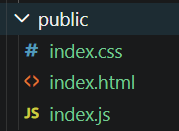
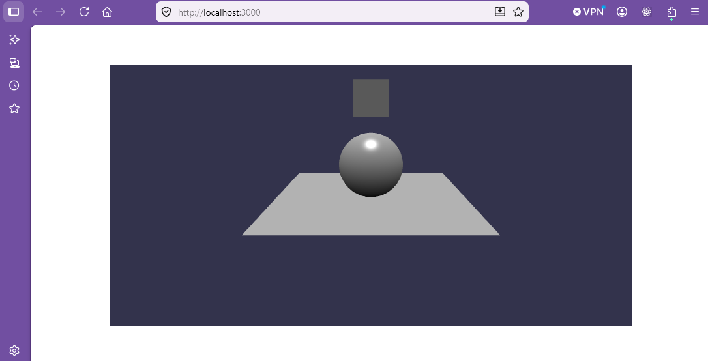
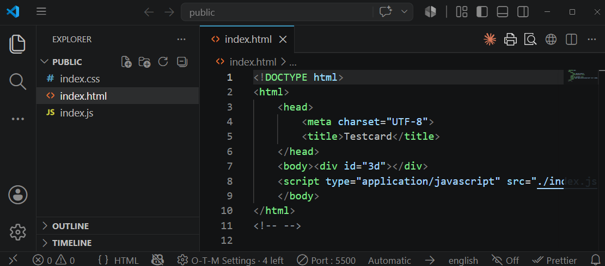
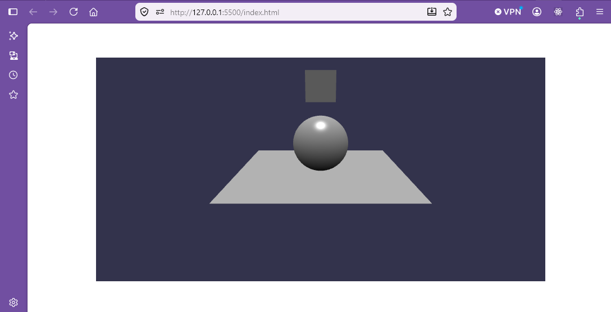

# Creating a production release

The test card is running on the bun development server, but it is not ready to be deployed to a standard web server.  That requires use of bun's [bundler](https://bun.com/blog/bun-bundler) to produce a concise file structure.

Part of this involves tree shaking, which is the term to describe the removal of unused code.  That ensures that the generated files are as small as practical for quick loading.

Before you progress make sure that the bun server is closed

> CTRL + c

Add a public folder to the testcard and in this make a copy of index.html

Remove the reference to the HTML base.
Add the script for index.js to this.

```html
<!DOCTYPE html>
<html>
    <head>
        <meta charset="UTF-8">
        <title>Testcard</title>
    </head>
    <body><div id="3d"></div> 
    <script type="application/javascript" src="./index.js"></script>
    </body>
</html>
```


Change directory to testcard

> cd testcard

Then build from the testcard directory enter:

> bun build index.ts \ 
> 
> --outdir public \ 
> 
> --target browser

The files in the public folder after building are:



To preview the build from the testcard directory use a bun HTML server.

> bunx serve public



Using file explorer make a copy of the public folder and store it back to a convenient location on your computer.  

Open this folder alone in visual studio code and preview it from the live server plug-in.



Note that this is opening a folder directly from the file store and not using a Docker container. 

The live server uses port 5500 so this is clearly being served from this folder.



This javascript file can now be used to provide 3D images within web pages.


