# Monorepo

The folder structure developed and tested for the testcard 3D scene is appropriate to developing a single project.

What is required at the moment is the ability to make several small projects in which the various aspects of BabylonJS cand be tested.  For that purpose the structure of the folder should be changed to a format named Monorepo.  The name is not inuitive!

At the moment the repository named BabylonJS has a main branch which is operating.  You might want to come back to this in future if you want to develop a single larger BabylonJS project so by adding a branch named single to the repository this state can be preserved and is easy to restore.

## single branch

Open github desktop with BabylonJSBun26 as the current repository and open the current branch tag.

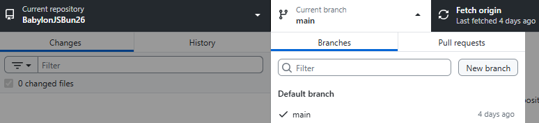

Click "New branch" to create a new branch named single.

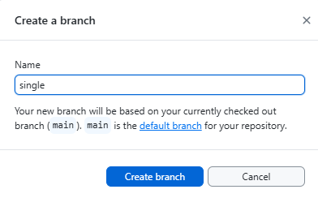

This will automatically copy the current state of the main branch into the new branch when "create branch" is selected.

The branch now exists on your local machine and needs to be published to exist on github.

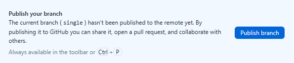

Note that Current branch shows single so with this selected when you show the branch in explorer only the few files which have already been created will be visible.  Any editing you do in visual studio code will only apply to this branch.

This branch is effectively being left as a restore position so it should not be edited. Return the current branch to main by clicking on main under the current branch tag.

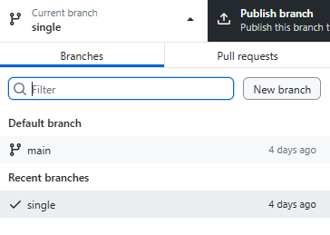

## development branch

The next stage of editing could be applied to the main branch, however main currently works and we are likely to break it at some point during the editng towards the next stage.

The solution is to make another branch named development which starts out as a copy of main.  In the process of the next stage of editing we may pause, leaving development as a non-operational work in progress secure in the knowlege that the working code in main is not being spoiled.

When the code in development is complete tested and working it can be copied back to main and this becomes the next milestone.

The process to make the development branch is the same as making the single branch, but you now have a choice which branch to base it on.

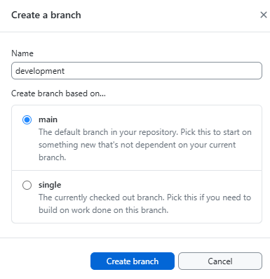

Publish the development branch to github.

Open the development branch in visual studio code.

The footer in VSCode shows that the docker container is open and that the correct branch is open.


# Changing structure

The endpoint for this sectgion will be to be able to run two versions of testcard, one with the cube above the sphere and one with the sphere above the cube as evidence that the structure is set up to run multiple small projects.

The structure of the **Monorepo / Multi-project workspace** will move towards

```text
my-bun-workspace/
├── node_modules/          # Single, shared node_modules for tooling & common packages
├── projects/              # A folder containing all your separate test cards
│   ├── testcard1/
│   │   ├── public
│   │   ├── createStartScene.ts
│   │   ├── index.html
│   │   ├── index.ts
│   │   └── main.css
│   ├── testcard1/
│   │   ├── public
│   │   ├── createStartScene.ts
│   │   ├── index.html
│   │   ├── index.ts
│   │   └── main.css
├── .gitignore             # Single gitignore for the repository
.gitattributes             # normalizing line feeds
├── bun.lock               # Single lockfile for dependencies
├── declaration.d.ts       # Single typescript declaration file
├── package.json           # Root package.json for the Bun workspace
├── server.ts              # Server for all files in the structure
└── tsconfig.json          # Root TypeScript configuration
```

* Move tsconfig.json from testcard to the root of the structure.

Note the include section in tsconfig.json

```json
"include": [
  "**/*.ts",
  "**/*.tsx",
  "declarations.d.ts" 
  ]
```

The ** refers to all nested folders so it does not need to be modified when tsconfig.json is moved to the root.

In the compiler options add "DOM" to the lib environment setup.

**tsconfig.json** (extract)
```json
"compilerOptions": {
    // Environment setup & latest features
    "lib": ["ESNext", "DOM"],
    "target": "ESNext",
    "module": "Preserve",
    "moduleDetection": "force",
    "jsx": "react-jsx",
    "allowJs": true,
    "types": ["bun"],
```    

* Delete redundant files and folders from the testcard folder.

Within the tescard folder delete files

    * .gitnore
    * bun.lock
    * package.json
    * README.md
and folder

    * node_modules

* Copy testcard (right click copy) and paste it back to the root of the structure to create testcard copy.

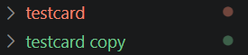

Dont worry about typescript errors at this stage.

* Rename folders to testcard1 and testcard2

* Create a projects folder in the root of the structure and drag the testcard folders into it.

* Open testcard1/index.html and change the base from testcard to projects/testcard1.

**testcard1/index.html**
```html
<!DOCTYPE html>
<html>
    <head>
        <base href="/projects/testcard1/">
        <meta charset="UTF-8">
        <title>Testcard</title>
    </head>
    <body> <div id="3d"></div> </body>
</html>
<script type="module" src="./index.ts"></script>
```
* Open testcard2/index.html and change the base from testcard to projects/testcard2.

* Edit testcard2/createStartScene.ts

Flip the y position of the sphere and the box so that the box,position y = 1 and the sphere.position.y = 3

**testcard2/createStartScene.ts** (extract)
```javascript
  function createBox(scene: Scene) {
    let box = MeshBuilder.CreateBox("box",{size: 1}, scene);
    box.position.y = 1;
    return box;
  }
  
  function createSphere(scene: Scene) {
    let sphere = MeshBuilder.CreateSphere(
      "sphere",
      { diameter: 2, segments: 32 },
      scene,
    );
    sphere.position.y = 3;
    return sphere;
  }
  ```

  Edit server.ts so that it serves by default testcard1 and also defaults to serving index.html if the path ends with /.

  **server.ts** (extract)
  ```javascript
Bun.serve({
  port: PORT,
  async fetch(req) {
    const url = new URL(req.url);
    let path = url.pathname;

    if (path === "/") {
        path = "/projects/testcard1/index.html";
    } else if (path.endsWith("/")) {
        // Serve index.html for directory requests
        path = path + "index.html";
    }

    const filePath = `.${path}`;
    const targetFile = file(filePath);
```

* A further tweak is to add a ! to the line 

**server.ts** (extract)
```javascript
const transpiled = await result.outputs[0]!.text();
```

The purpose of the ! is to say that you the programmer confirm that result.outputs[0] exists.  Otherwise typescript throws up a warning that it may not exist.

OK for clarity here is the full listing of server.ts

**server.ts** (full)
```javascript
import { file } from "bun";

const PORT = 3000;

// MIME type mapping
const mimeTypes: Record<string, string> = {
  ".ts": "application/javascript",
  ".js": "application/javascript",
  ".json": "application/json",
  ".html": "text/html",
  ".css": "text/css",
  ".png": "image/png",
  ".jpg": "image/jpeg",
  ".gif": "image/gif",
  ".svg": "image/svg+xml",
};

Bun.serve({
  port: PORT,
  async fetch(req) {
    const url = new URL(req.url);
    let path = url.pathname;

    if (path === "/") {
        path = "/projects/testcard1/index.html";
    } else if (path.endsWith("/")) {
        // Serve index.html for directory requests
        path = path + "index.html";
    }

    const filePath = `.${path}`;
    const targetFile = file(filePath);

    if (await targetFile.exists()) {
      // Get file extension
      const ext = path.substring(path.lastIndexOf("."));
      
      // Handle TypeScript transpilation for browser modules
      if (ext === ".ts") {
        const result = await Bun.build({
          entrypoints: [filePath],
          format: "esm",
        });
        
        if (!result.success) {
          return new Response(`Build error: ${result.logs.join('\n')}`, { status: 500 });
        }
        
        const transpiled = await result.outputs[0]!.text();
        
        return new Response(transpiled, {
          headers: { "Content-Type": "application/javascript" }
        });
      }
      
      // Serve other file types normally
      const contentType = mimeTypes[ext] || "application/octet-stream";
      return new Response(targetFile, {
        headers: { "Content-Type": contentType }
      });
    }

    return new Response("File not found", { status: 404 });
  },
});

console.log(`Babylon.js server running at http://localhost:${PORT}`);
```


* Update package.json to add the workspace feature to bun and add a script for an easy startup.

```json
{
  "name": "babylonbun26",
  "version": "1.0.0",
  "private": true,
  "workspaces": [
    "projects/*"
  ],
  "scripts": {
    "serve": "bun --hot ./server.ts"
  },

  "dependencies": {
    "@babylonjs/core": "^9.13.0",
    "@babylonjs/havok": "^1.3.12",
    "@babylonjs/inspector": "^9.13.0",
    "@babylonjs/loaders": "^9.13.0"
  },
  "devDependencies": {
    "@types/bun": "^1.3.14",
    "typescript": "^6.0.3"
  }
}
```

Close vscode on the repository and re-open to reboot the container.

At this point there should be no typescript errors or problems noted in the vscode display.

Check operation with 

> bun run serve

also try:

> http://localhost:3000/projects/testcard1/

and

> http://localhost:3000/projects/testcard2/

Testcart2 appears as:


## Check build

Testcard1 is already built.  To make sure that within this new structure we can build scenes from individual folders testcard 2 can be built following the same process.

Before you progress make sure that the bun server is closed

    CTRL + c

Delete index.js and index.html in testcard2/public, those  is a copy of the testcard1 build.

Copy index.html from the testcard2 folder into testcard2/public.  

Rename the title and  remove the reference to the HTML base. Point the script to index.js.

```html
<!DOCTYPE html>
<html>
    <head>
        <meta charset="UTF-8">
        <title>Testcard 2</title>
    </head>
    <body> <div id="3d"></div> </body>
</html>
<script type="module" src="./index.js"></script>
```

Change directory to testcard2

>    cd projects/testcard2

Then build from the testcard directory enter:

    bun build index.ts \

    --outdir public \

    --target browser

```bash
# bun build index.ts \
> --outdir public \
> --target browser
Bundled 3036 modules in 1814ms
```

To preview the build from the testcard2 directory use a bun HTML server.

>    bunx serve public

The built file is run.

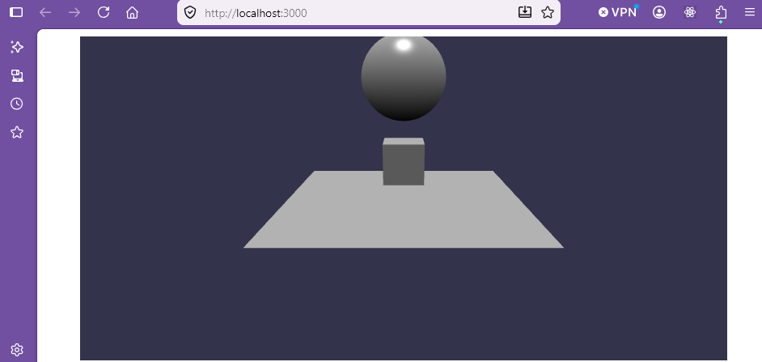

## Update to main

Now the code is at a working stage the changes can be moved added to the main branch.

First the changes worked on need to be committed with a summary and a description.

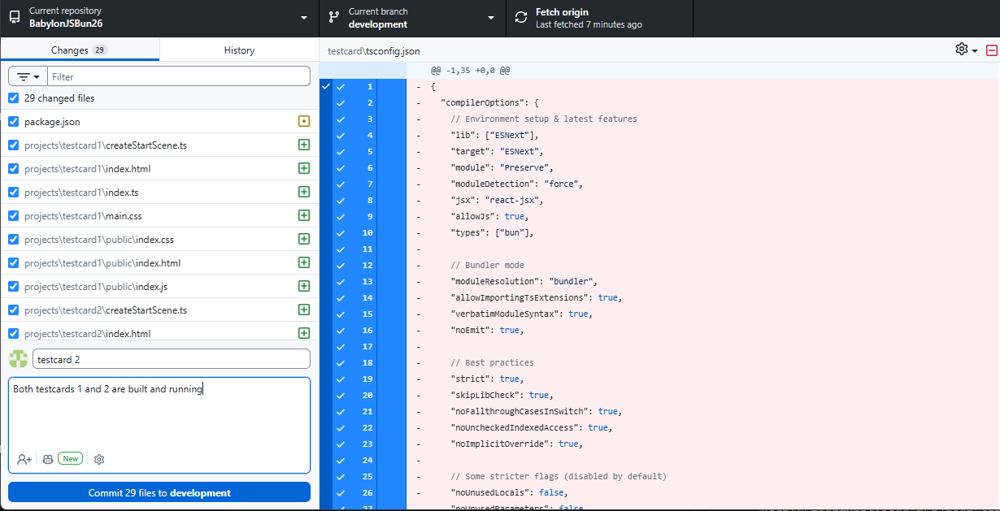

Push to origin to copy to github.

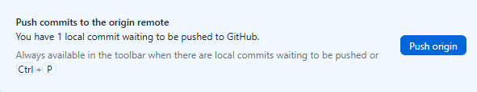

Re-select the main branch from the current branch tag.

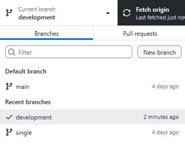

Now do a **merge commit** to bring the contents of the development branch into main.

With the main branch selected choose a branch to merge into main

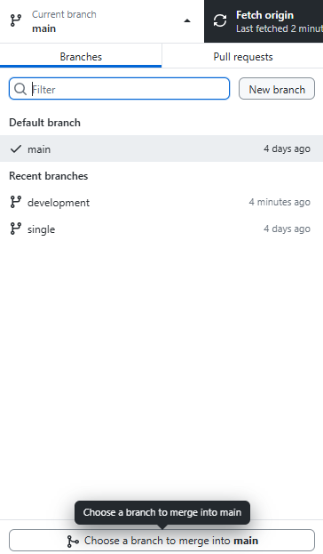

Select development from the dialogue.

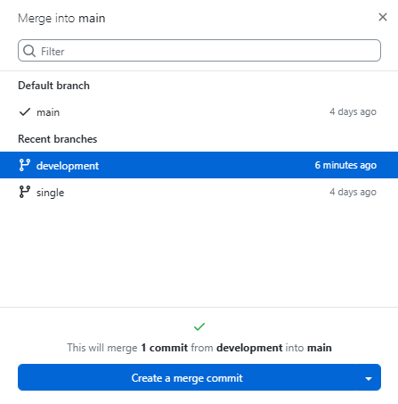

Click on "create a merge commit"

After a successful merge, push origin again and the merged files are now on githug.

The main and development branches are identical and the next stage of programming can be carried out in the development branch without interupting the flow of the working software.