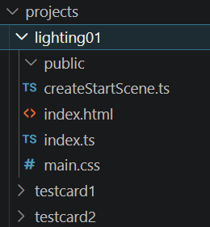
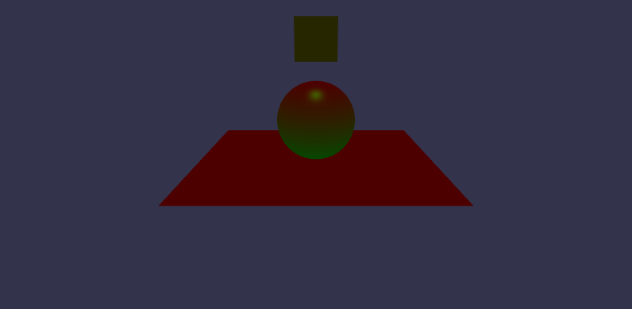
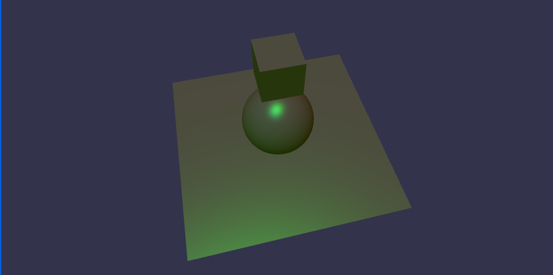
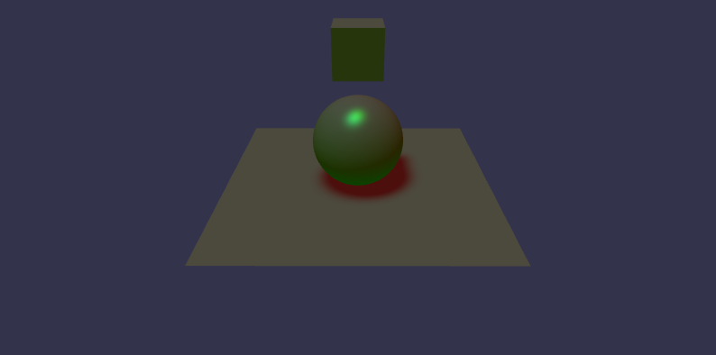
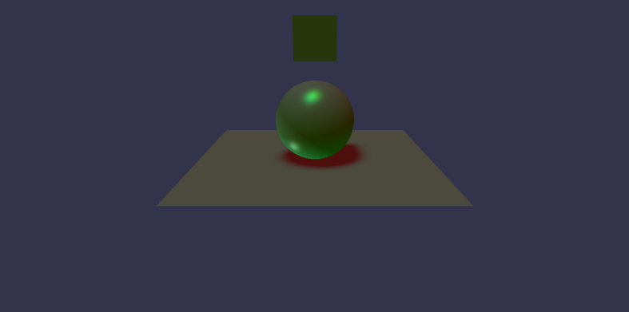
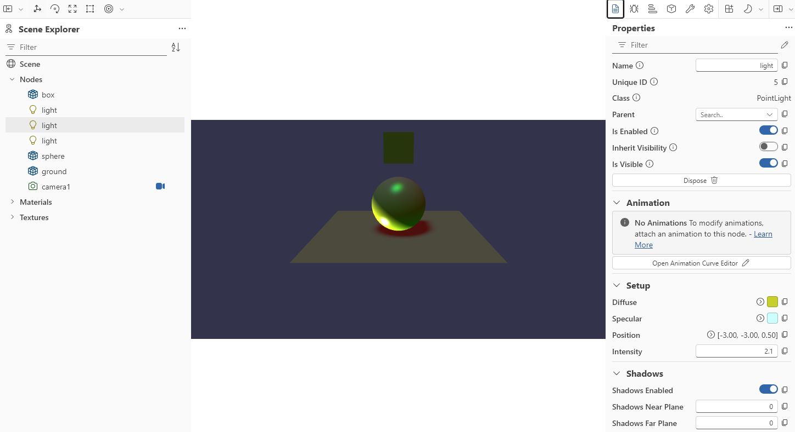
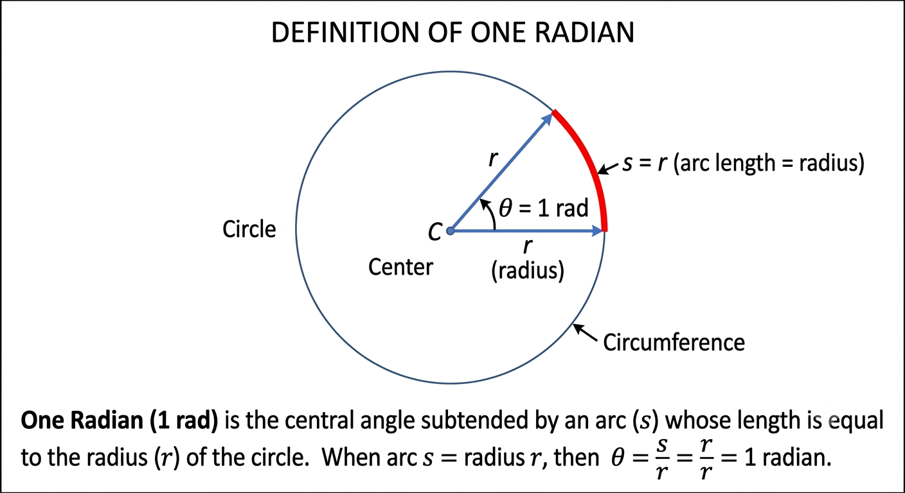
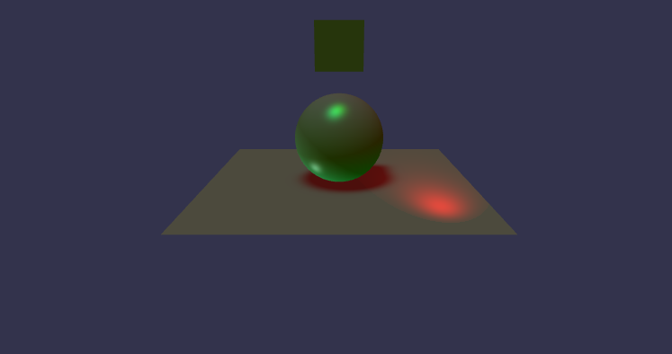
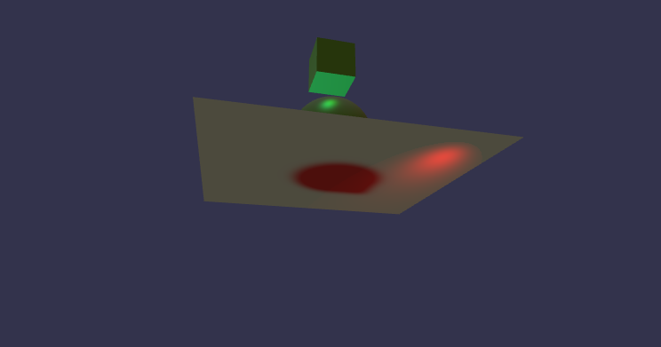
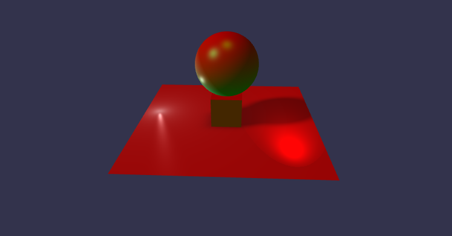

# Lighting

In this section some basic lighting will be added to the testcard scene.

The babylon documentation features detailed lighting examples starting from an [introduction to lights](https://doc.babylonjs.com/features/featuresDeepDive/lights/lights_introduction/)


Open BabylonJsBun26 in via github desktop selecting the **development** branch.

Copy testcard1 folder and paste back into the projects folder.  Rename the new folder to lighting01 and remove the files from the public folder under lighting01.

Rename the title of index.html to Lighting01.
Rename the base of index,html to href="/projects/lighting01/".

So index,html becomes

**projects/lighting01/index.html**
```html
<!DOCTYPE html>
<html>
    <head>
        <base href="/projects/lighting01/">
        <meta charset="UTF-8">
        <title>Lighting01</title>
    </head>
    <body> <div id="3d"></div> </body>
</html>
<script type="module" src="./index.ts"></script>
```



Note these basic steps for the creation of a new small project and apply each time a new project is required.

## Lighting Options

In the previous section a basic scene with lighting was described.  There are a range of [lighting options available](https://doc.babylonjs.com/features/featuresDeepDive/lights/lights_introduction#tmp) which include:

* HemisphericLight - Ambient environment
* PointLight - Emits in all directions from a point
* DirectionalLight - Emits in a direction set by a vector
* SpotLight - Emits in a direction with a conical beam

In Babylon.js, all light types (PointLight, DirectionalLight, SpotLight, and HemisphericLight) inherit from the base Light class. This gives them a shared set of configuration parameters that dictate how they tint surfaces, drop off in power, or affect specific meshes.

Here is the breakdown of the parameters common to all Babylon.js light types:

| Parameter | Type | Common / Default Value | Visual Effect & Behavior |
| :--- | :--- | :--- | :--- |
| **`diffuse`** | `BABYLON.Color3` | `new Color3(1, 1, 1)` (White) | The core color the light emits. It tints the base color (`diffuseTexture` / `albedoColor`) of all illuminated surfaces. |
| **`specular`** | `BABYLON.Color3` | `new Color3(1, 1, 1)` (White) | Creates the bright, glossy highlight reflection on standard materials depending on the viewing angle. *(Note: Unused on PBR materials, which calculate reflections automatically via roughness/metalness).* |
| **`intensity`** | `number` | `1.0` | The brightness multiplier of the light. Setting this to `0.0` essentially turns the light off without disabling it; high numbers (e.g., `5.0+`) create blindingly bright exposures. |
| **`range`** | `number` | `Number.MAX_VALUE` | Defines the maximum distance (in scene units) that the light's rays travel before fading completely. *(Note: Unused by PBR materials if they are set to use physical inverse-squared falloff).* |
| **`falloffType`** | `number` | `Light.FALLOFF_DEFAULT` | Determines the mathematical curve of how light intensity decays over distance. Options include `FALLOFF_STANDARD`, `FALLOFF_GLTF`, and `FALLOFF_PHYSICAL`. |
| **`excludedMeshes`** | `AbstractMesh[]` | `[]` (Empty Array) | An array of specific meshes that this light will completely ignore. Explicitly targeted objects will remain dark. |
| **`includedOnlyMeshes`**| `AbstractMesh[]` | `[]` (Empty Array) | If populated, *only* the meshes listed in this array will be illuminated by this light; all other meshes in the scene bypass it. |
| **`lightmapMode`** | `number` | `Light.LIGHTMAP_DEFAULT` | Configures how this dynamic light interacts with pre-baked lightmaps (e.g., whether it adds to, multiplies, or replaces parts of the bake via constants like `LIGHTMAP_SPECULAR`). |
| **`renderPriority`** | `number` | `0` | Determines the rendering evaluation order of the light. This is useful when the number of lights in your scene exceeds a material's `maxSimultaneousLights` threshold (which defaults to 4). |

---

### Quick Functional Methods

In addition to the parameters above, all light classes share these essential control mechanisms:

* **`light.setEnabled(boolean)`**: Completely flags the light as active (`true`) or inactive (`false`), saving WebGL performance.
* **`light.dispose()`**: Safely destroys the light instance and cleans its memory out of the active scene graph.

## Hemispheric light

*Simulates ambient environmental or sky-and-ground lighting.*

The most basic light is the The [hemispheric light](https://doc.babylonjs.com/typedoc/classes/BABYLON.HemisphericLight).  This represents light equally distributed from all directions above ground.  This gives basic scene lighting, but can be flat and dull used on its own.

This light shines on objects nominally from above and determines the colour which will be reflected from ground onto objects from below.

Hemispheric light has its own particular pararmeters:

| Parameter | Type | Common / Default Value | Visual Effect & Behavior |
| :--- | :--- | :--- | :--- |
| **`direction`** | `BABYLON.Vector3` | `new Vector3(0, 1, 0)` (Upwards) | Defines the axis of the environment's sky. Surfaces facing toward this vector receive the `diffuse` color, while surfaces facing the exact opposite direction receive the `groundColor`. |
| **`groundColor`** | `BABYLON.Color3` | `new Color3(0, 0, 0)` (Black) | Specifies the color emitted from the ground upwards. It simulates ambient bounce light, blending smoothly with the `diffuse` color on surfaces perpendicular to the light's direction vector. |

---

### Important Context

While properties like `intensity`, `falloffType`, and `includedOnlyMeshes` are inherited from the base `Light` class, **`direction`** and **`groundColor`** function uniquely for the `HemisphericLight`:

* **No Shadows:** Unlike `DirectionalLight` or `SpotLight`, a `HemisphericLight` cannot cast shadows (`ShadowGenerator` will throw an error if passed a hemispheric light).
* **No Specular Highlights:** The light is entirely ambient and directional-blended; it does not produce localized shiny reflections (specular highlights) on materials.

Now open projects/lighting01/createStartScene and edit to add [Color3](https://doc.babylonjs.com/typedoc/classes/_babylonjs_core.Color3) an RGB expression of color values ranging from (0,0,0) to (1,1,1):

**projects/lighting01/createStartScene.ts** (extract)
```javascript
import {
    Engine,
    Scene,
    ArcRotateCamera,
    Vector3,
    Color3,
    HemisphericLight,
    MeshBuilder,
  } from "@babylonjs/core";
```  
Edit the section for hemispheric light

**projects/lighting01/createStartScene.ts** (extract)
```javascript
function createHemisphericLight(scene: Scene) {
  const light: HemisphericLight = new HemisphericLight(
    "light",
    new Vector3(0, 1, 0),
    scene,
  );
  light.intensity = 0.3;
  light.diffuse = new Color3(1, 0, 0);
  light.specular = new Color3(0, 1, 0);
  light.groundColor = new Color3(0, 1, 0);
  return light;
}
```

Change the name of the function near the bottom of the file from createLight to create Hemispheric light.

**projects/lighting01/createStartScene.ts**  (full listing)
```javascript
import {
  Engine,
  Scene,
  ArcRotateCamera,
  Vector3,
  Color3,
  HemisphericLight,
  MeshBuilder,
} from "@babylonjs/core";

function createBox(scene: Scene) {
  let box = MeshBuilder.CreateBox("box", { size: 1 }, scene);
  box.position.y = 3;
  return box;
}

function createHemisphericLight(scene: Scene) {
  const light: HemisphericLight = new HemisphericLight(
    "light",
    new Vector3(0, 1, 0),
    scene,
  );
  light.intensity = 0.3;
  light.diffuse = new Color3(1, 0, 0);
  light.specular = new Color3(0, 1, 0);
  light.groundColor = new Color3(0, 1, 0);
  return light;
}

function createSphere(scene: Scene) {
  let sphere = MeshBuilder.CreateSphere(
    "sphere",
    { diameter: 2, segments: 32 },
    scene,
  );
  sphere.position.y = 1;
  return sphere;
}

function createGround(scene: Scene) {
  let ground = MeshBuilder.CreateGround(
    "ground",
    { width: 6, height: 6 },
    scene,
  );
  return ground;
}

function createArcRotateCamera(scene: Scene) {
  let camAlpha = -Math.PI / 2,
    camBeta = Math.PI / 2.5,
    camDist = 10,
    camTarget = new Vector3(0, 0, 0);
  let camera = new ArcRotateCamera(
    "camera1",
    camAlpha,
    camBeta,
    camDist,
    camTarget,
    scene,
  );
  camera.attachControl(true);
  return camera;
}

export function createStartScene(engine: Engine) {
  let myscene: Scene = new Scene(engine);
  createBox(myscene);
  createHemisphericLight(myscene);
  createSphere(myscene);
  createGround(myscene);
  createArcRotateCamera(myscene);

  return myscene;
}

```

View with:

>bun run serve

> http://localhost:3000/projects/lighting01/



**Experiment** with different values of the lighing parameters.

The inspector can be switched back on in index.ts and this allows the effect of ligthing parameters to be viewed more easily than editing the code directly. 

Return back to these settings which are dull so they dont mask the effects of other lights.

## Directional light

*Simulates an omnidirectional bulb radiating light in all directions from a single point.*

*Simulates an infinitely distant light source emitting parallel rays (like the Sun).*

| Parameter | Type | Default Value | Visual Effect & Behavior |
| :--- | :--- | :--- | :--- |
| **`direction`** | `BABYLON.Vector3` | `(0, -1, 0)` | The vector direction the parallel light rays travel. Unlike HemisphericLight, this determines the angle of cast shadows. |
| **`position`** | `BABYLON.Vector3` | `(0, 0, 0)` | Even though rays are parallel, the position vector serves as the starting anchor/frustum origin for calculating shadow maps. |

In projects/lighting01/startScene.ts, import the directional light.

**projects/lighting01/startScene.ts** (extract)
```javascript
import {
  Engine,
  Scene,
  ArcRotateCamera,
  Vector3,
  Color3,
  HemisphericLight,
  DirectionalLight,
  MeshBuilder,
} from "@babylonjs/core";
```

Add a function to create a directional light.

**projects/lighting01/startScene.ts** (extract)
```javascript
function createDirectionalLight(scene: Scene) {
  const light = new DirectionalLight("light", new Vector3(0.2, -1, 0.2), scene);
  light.position = new Vector3(20, 40, 10);
  light.intensity = 0.5;
  light.diffuse = new Color3(0, 0.6, 0.5);
  light.specular = new Color3(0, 0.7, 0.3);
  return light;
}
```

Call the createDirectionalLight function to add this light to the scene.

**projects/lighting01/startScene.ts** (extract)
```javascript
export function createStartScene(engine: Engine) {
  let myscene: Scene = new Scene(engine);
  createBox(myscene);
  createHemisphericLight(myscene);
  createDirectionalLight(myscene);
  createSphere(myscene);
  createGround(myscene);
  createArcRotateCamera(myscene);

  return myscene;
}
```

Bun is hot reloading so to see the effect you just need to reload the page.



> http://localhost:3000/projects/lighting01/

## Directional shadows

A directional light can create shadows, but so can other lights in the scene and there may even be multiple directional lights.

This raises the question which light casts the shadow.  

Babylon shadows are generated by a [ShadowGenerator](https://doc.babylonjs.com/features/featuresDeepDive/lights/shadows/) which needs to know the size of the region where shadows are to be cast (shadowmap size) and which light will cast the shadow.

The [ShadowGenerator](https://doc.babylonjs.com/typedoc/classes/_babylonjs_core.ShadowGenerator) properties are listed in full in the BabylonJS API.

Shadows have a computational overhead so limit the objects which can recieve shadows by controlling the recieveShadows property.

Typically let the ground recieve shadows.

So import a ShadowGenerator:

**projects/lighting01/startScene.ts** (extract)
```javascript
import {
  Engine,
  Scene,
  ArcRotateCamera,
  Vector3,
  Color3,
  HemisphericLight,
  DirectionalLight,
  MeshBuilder,
  ShadowGenerator
} from "@babylonjs/core";
```

Add a fuction createShadows which will create a shadowgenerator and setup some of the key properties.

Pass to this function the shapes which will cast the shadows.

Create a new ShadowGenerator 

Use the getShadowMap method of the ShadowGenerator to give access to the shadow map.

Add the objects to cast the shadow to the shadow map renderList.

Set the ShadowGenerator properties to control the sharpness and intensity of the shadow.

**projects/lighting01/startScene.ts** (extract)
```javascript
function createShadows(light: DirectionalLight, sphere: Mesh ,box: Mesh){
    const shadower = new ShadowGenerator(1024, light);
    const sm : any = shadower.getShadowMap();
    sm.renderList.push(sphere, box);

    shadower.setDarkness(0.2);
    shadower.useBlurExponentialShadowMap = true;
    shadower.blurScale = 4;
    shadower.blurBoxOffset = 1;
    shadower.useKernelBlur = true;
    shadower.blurKernel = 64;
    shadower.bias = 0;
    return shadower;
}
```

This function needs to recieve meshes as arguments so the Mesh must be imported to this module.

**projects/lighting01/startScene.ts** (extract)
```javascript
import {
  Engine,
  Scene,
  ArcRotateCamera,
  Vector3,
  Color3,
  HemisphericLight,
  DirectionalLight,
  PointLight,
  MeshBuilder,
  Mesh,
  ShadowGenerator
} from "@babylonjs/core";
```

Make the ground recieve shadows:

**projects/lighting01/startScene.ts** (extract)
```javascript
function createGround(scene: Scene) {
  let ground = MeshBuilder.CreateGround(
    "ground",
    { width: 6, height: 6 },
    scene,
  );
  ground.receiveShadows = true;
  return ground;
}
```

Now edit the exports so that the dynamic light, box and sphere can be passed to the createShadows function.

**projects/lighting01/startScene.ts** (extract)
```javascript
export function createStartScene(engine: Engine) {
  let myscene: Scene = new Scene(engine);
  let box = createBox(myscene);
  createHemisphericLight(myscene);
  let dl = createDirectionalLight(myscene);
  let sphere = createSphere(myscene);
  createGround(myscene);
  createArcRotateCamera(myscene);
  createShadows(dl,sphere,box)

  return myscene;
}
```
For clarity the full listing of projects/lighting01/startScene.ts at this stage is:

**projects/lighting01/startScene.ts** (full listing)
```javascript
import {
  Engine,
  Scene,
  ArcRotateCamera,
  Vector3,
  Color3,
  HemisphericLight,
  DirectionalLight,
  MeshBuilder,
  Mesh,
  ShadowGenerator
} from "@babylonjs/core";

function createBox(scene: Scene) {
  let box = MeshBuilder.CreateBox("box", { size: 1 }, scene);
  box.position.y = 3;
  return box;
}

function createHemisphericLight(scene: Scene) {
  const light: HemisphericLight = new HemisphericLight(
    "light",
    new Vector3(0, 1, 0),
    scene,
  );
  light.intensity = 0.3;
  light.diffuse = new Color3(1, 0, 0);
  light.specular = new Color3(0, 1, 0);
  light.groundColor = new Color3(0, 1, 0);
  return light;
}

function createDirectionalLight(scene: Scene) {
  const light = new DirectionalLight("light", new Vector3(0.2, -1, 0.2), scene);
  light.position = new Vector3(20, 40, 10);
  light.intensity = 0.5;
  light.diffuse = new Color3(0, 0.6, 0.5);
  light.specular = new Color3(0, 0.7, 0.3);
  return light;
}

function createShadows(light: DirectionalLight, sphere: Mesh ,box: Mesh){
    const shadower = new ShadowGenerator(1024, light);
    const sm : any = shadower.getShadowMap();
    sm.renderList.push(sphere, box);

    shadower.setDarkness(0.2);
    shadower.useBlurExponentialShadowMap = true;
    shadower.blurScale = 4;
    shadower.blurBoxOffset = 1;
    shadower.useKernelBlur = true;
    shadower.blurKernel = 64;
    shadower.bias = 0;
    return shadower;
}

function createSphere(scene: Scene) {
  let sphere = MeshBuilder.CreateSphere(
    "sphere",
    { diameter: 2, segments: 32 },
    scene,
  );
  sphere.position.y = 1;
  return sphere;
}

function createGround(scene: Scene) {
  let ground = MeshBuilder.CreateGround(
    "ground",
    { width: 6, height: 6 },
    scene,
  );
  ground.receiveShadows = true;
  return ground;
}

function createArcRotateCamera(scene: Scene) {
  let camAlpha = -Math.PI / 2,
    camBeta = Math.PI / 2.5,
    camDist = 10,
    camTarget = new Vector3(0, 0, 0);
  let camera = new ArcRotateCamera(
    "camera1",
    camAlpha,
    camBeta,
    camDist,
    camTarget,
    scene,
  );
  camera.attachControl(true);
  return camera;
}

export function createStartScene(engine: Engine) {
  let myscene: Scene = new Scene(engine);
  let box = createBox(myscene);
  createHemisphericLight(myscene);
  let dl = createDirectionalLight(myscene);
  let sphere = createSphere(myscene);
  createGround(myscene);
  createArcRotateCamera(myscene);
  createShadows(dl,sphere,box)

  return myscene;
}
```

The shadows start to appear.



**Experiment** with light positions colors intensities and shadow properties.


## Point lights

*Simulates an omnidirectional bulb radiating light in all directions from a single point.*

| Parameter | Type | Default Value | Visual Effect & Behavior |
| :--- | :--- | :--- | :--- |
| **`position`** | `BABYLON.Vector3` | `(0, 0, 0)` | The precise 3D coordinate origin in world space from which the light rays emit radially outward. |

Now A [pointlight](https://doc.babylonjs.com/features/featuresDeepDive/lights/lights_introduction/#the-point-light) will be added.

Import the PointLight.

**projects/lighting01/startScene.ts** (extract)
```javascript
import {
  Engine,
  Scene,
  ArcRotateCamera,
  Vector3,
  Color3,
  HemisphericLight,
  DirectionalLight,
  PointLight,
  MeshBuilder,
  ShadowGenerator
} from "@babylonjs/core";
```

Add a function which will generate a pointLight.  The details of the properties and methods of [pointlight](https://doc.babylonjs.com/typedoc/classes/BABYLON.PointLight) are listed in the API

**projects/lighting01/startScene.ts** (extract)
```javascript
function createPointLight(scene: Scene ){
    const light = new PointLight("light", new Vector3(-3, -3, 0.5),scene);
    light.intensity = 0.3;
    light.diffuse = new Color3(0.5, 1, 1);
    light.specular = new Color3(0.8, 1, 1);
    return light;
}
```

Add a call to the createPointLight function:


**projects/lighting01/startScene.ts** (extract)
```javascript
export function createStartScene(engine: Engine) {
  let myscene: Scene = new Scene(engine);
  let box = createBox(myscene);
  createHemisphericLight(myscene);
  createPointLight(myscene);
  let dl = createDirectionalLight(myscene);
  let sphere = createSphere(myscene);
  createGround(myscene);
  createArcRotateCamera(myscene);
  createShadows(dl,sphere,box)

  return myscene;
}
```
The result of adding this light can be seen in the reflection towards the bottom right of the sphere.

Note that lights have an effect, but they do not appear as objects in a scene.  Often lighting will be associated with objects to show where they are.



**Experiment** with the settings of the point light.

Bring the inspector pane back up and try altering the light properties.



### Using the Inspector

Note that the current [inspector](https://doc.babylonjs.com/toolsAndResources/inspectorv2/) version is V2 and be aware that online notes or books may refer to V1.  The versions of BabylonJS keep moving on so care must always be taken to check any notes or tutorials against the current babylon documentation.

There are copy icons at the side of each parameter.  These can be copied and pasted back into code.  Since bun is hot loading this can be a good route to fixing lighting.
   
The inspector has light and dark themes switchable from an icon above the right hand panel. A dark theme is good for checking lighting.   


## SpotLight
*Simulates a conical beam of light emitting from a specific point in a constrained direction (like a flashlight).*

| Parameter | Type | Default Value | Visual Effect & Behavior |
| :--- | :--- | :--- | :--- |
| **`position`** | `BABYLON.Vector3` | `(0, 0, 0)` | The precise 3D origin location of the spotlight vertex. |
| **`direction`** | `BABYLON.Vector3` | `(0, -1, 0)` | The central axis pointing toward where the spotlight cone is aimed. |
| **`angle`** | `number` | `Math.PI / 3` | The total spread or opening field-of-view of the spotlight cone, measured in **radians**. |
| **`exponent`** | `number` | `2.0` | Controls the falloff sharpness from the bright center of the spotlight cone out to its edges (higher numbers create a sharper spotlight edge). |
| **`innerAngle`** | `number` | `0` | Defines a sharp inner cone beam angle (in radians) where light intensity stays at 100% before starting to attenuate toward the outer `angle`. |

### Radians

The cone angle uses radians rather than degrees.



There are 360 degrees in a circle and 2 pi (around 6.3) radians in a circle.

1 degree = 2 pi /360 = 0.017 radian

1 radian = 360 / 2 pi = 57 degrees


To add a spotlight to the scene, first import the Spotlight.

**projects/lighting01/startScene.ts** (extract)
```javascript
import {
  Engine,
  Scene,
  ArcRotateCamera,
  Vector3,
  Color3,
  HemisphericLight,
  DirectionalLight,
  PointLight,
  SpotLight,
  MeshBuilder,
  Mesh,
  ShadowGenerator
} from "@babylonjs/core";
```

Then add a function which will add a spotlight to the scene.

The value of pi is represented by Math.PI a value of PI/3 is 1/6th of a circle 60 degrees.

**projects/lighting01/startScene.ts** (extract)
```javascript
function createSpotLight(scene: Scene ){
    const light = new SpotLight("light", new Vector3(2, 1, -3), 
        new Vector3(0, -2, 3), Math.PI / 3, 20, scene);
    light.intensity = 1.0;
    light.diffuse = new Color3(1, 0, 0);
    light.specular = new Color3(0, 1, 0);
    return light;
}
```

Now add a call to this to add a light to the scene.

**projects/lighting01/startScene.ts** (extract)
```javascript
export function createStartScene(engine: Engine) {
  let myscene: Scene = new Scene(engine);
  let box = createBox(myscene);
  createHemisphericLight(myscene);
  createPointLight(myscene);
  createSpotLight(myscene);
  let dl = createDirectionalLight(myscene);
  let sphere = createSphere(myscene);
  createGround(myscene);
  createArcRotateCamera(myscene);
  createShadows(dl,sphere,box)

  return myscene;
}
```
View the output



**Experiment** with moving the spotlight and creating shadows from it.

## Ground

When the camera is moved to view the ground from below it becomes invisible the back face of the ground plane is transparent.  The back face has been culled.

This can be improved by using a standard material for the ground and setting the backface culling to false.

So we need to import the StandardMaterial.

**projects/lighting01/startScene.ts** (extract)
```javascript
import {
  Engine,
  Scene,
  ArcRotateCamera,
  Vector3,
  Color3,
  HemisphericLight,
  DirectionalLight,
  PointLight,
  SpotLight,
  MeshBuilder,
  Mesh,
  StandardMaterial,
  ShadowGenerator
} from "@babylonjs/core";
```

Then update the createGrouond function.

**projects/lighting01/startScene.ts** (extract)
```javascript
function createGround(scene: Scene){
    let ground = MeshBuilder.CreateGround("ground", { width: 6, height: 6 }, scene);
    var groundMaterial = new StandardMaterial("groundMaterial", scene);
    groundMaterial.backFaceCulling = false;
    ground.material = groundMaterial;
    ground.receiveShadows = true;
    return ground;
}
```

Now view again and move the camera below ground to see the effect.



The full listing at this point is:

**projects/lighting01/startScene.ts** (full)
```javascript
import {
  Engine,
  Scene,
  ArcRotateCamera,
  Vector3,
  Color3,
  HemisphericLight,
  DirectionalLight,
  PointLight,
  SpotLight,
  MeshBuilder,
  Mesh,
  StandardMaterial,
  ShadowGenerator
} from "@babylonjs/core";

function createBox(scene: Scene) {
  let box = MeshBuilder.CreateBox("box", { size: 1 }, scene);
  box.position.y = 3;
  return box;
}

function createHemisphericLight(scene: Scene) {
  const light: HemisphericLight = new HemisphericLight(
    "light",
    new Vector3(0, 1, 0),
    scene,
  );
  light.intensity = 0.3;
  light.diffuse = new Color3(1, 0, 0);
  light.specular = new Color3(0, 1, 0);
  light.groundColor = new Color3(0, 1, 0);
  return light;
}

function createDirectionalLight(scene: Scene) {
  const light = new DirectionalLight("light", new Vector3(0.2, -1, 0.2), scene);
  light.position = new Vector3(20, 40, 10);
  light.intensity = 0.5;
  light.diffuse = new Color3(0, 0.6, 0.5);
  light.specular = new Color3(0, 0.7, 0.3);
  return light;
}

function createPointLight(scene: Scene ){
    const light = new PointLight("light", new Vector3(-3, -3, 0.5),scene);
    light.intensity = 0.3;
    light.diffuse = new Color3(0.5, 1, 1);
    light.specular = new Color3(0.8, 1, 1);
    return light;
}

function createSpotLight(scene: Scene ){
    const light = new SpotLight("light", new Vector3(2, 1, -3), 
        new Vector3(0, -2, 3), Math.PI / 3, 20, scene);
    light.intensity = 1.0;
    light.diffuse = new Color3(1, 0, 0);
    light.specular = new Color3(0, 1, 0);
    return light;
}

function createShadows(light: DirectionalLight, sphere: Mesh ,box: Mesh){
    const shadower = new ShadowGenerator(1024, light);
    const sm : any = shadower.getShadowMap();
    sm.renderList.push(sphere, box);

    shadower.setDarkness(0.2);
    shadower.useBlurExponentialShadowMap = true;
    shadower.blurScale = 4;
    shadower.blurBoxOffset = 1;
    shadower.useKernelBlur = true;
    shadower.blurKernel = 64;
    shadower.bias = 0;
    return shadower;
}

function createSphere(scene: Scene) {
  let sphere = MeshBuilder.CreateSphere(
    "sphere",
    { diameter: 2, segments: 32 },
    scene,
  );
  sphere.position.y = 1;
  return sphere;
}

function createGround(scene: Scene){
    let ground = MeshBuilder.CreateGround("ground", { width: 6, height: 6 }, scene);
    var groundMaterial = new StandardMaterial("groundMaterial", scene);
    groundMaterial.backFaceCulling = false;
    ground.material = groundMaterial;
    ground.receiveShadows = true;
    return ground;
}

function createArcRotateCamera(scene: Scene) {
  let camAlpha = -Math.PI / 2,
    camBeta = Math.PI / 2.5,
    camDist = 10,
    camTarget = new Vector3(0, 0, 0);
  let camera = new ArcRotateCamera(
    "camera1",
    camAlpha,
    camBeta,
    camDist,
    camTarget,
    scene,
  );
  camera.attachControl(true);
  return camera;
}

export function createStartScene(engine: Engine) {
  let myscene: Scene = new Scene(engine);
  let box = createBox(myscene);
  createHemisphericLight(myscene);
  createPointLight(myscene);
  createSpotLight(myscene);
  let dl = createDirectionalLight(myscene);
  let sphere = createSphere(myscene);
  createGround(myscene);
  createArcRotateCamera(myscene);
  createShadows(dl,sphere,box)

  return myscene;
}

```


## Final Polish

To finish off I will just tweak the image.

* The locations of the sphere and the box are adjusted.
  * Note that the ground is not placed at y=0.5 as it's face would intersect witht the ground plane creating an odd effect when viewed from below.  Instead add a small ammount of offset y = 0.501.

* Change the color, intensity and direction of the directional light.

* change the intensity and position of the point light.

With those small changes the final image is much more interesting.

The final listing is now:

The full listing at this point is:

**projects/lighting01/startScene.ts** (full final)
```javascript
import {
  Engine,
  Scene,
  ArcRotateCamera,
  Vector3,
  Color3,
  HemisphericLight,
  DirectionalLight,
  PointLight,
  SpotLight,
  MeshBuilder,
  Mesh,
  StandardMaterial,
  ShadowGenerator
} from "@babylonjs/core";

function createBox(scene: Scene) {
  let box = MeshBuilder.CreateBox("box", { size: 1 }, scene);
  box.position.y = 0.0;
  box.position.y = 0.501
  return box;
}

function createHemisphericLight(scene: Scene) {
  const light: HemisphericLight = new HemisphericLight(
    "light",
    new Vector3(0, 1, 0),
    scene,
  );
  light.intensity = 0.3;
  light.diffuse = new Color3(1, 0, 0);
  light.specular = new Color3(0, 1, 0);
  light.groundColor = new Color3(0, 1, 0);
  return light;
}

function createDirectionalLight(scene: Scene) {
  const light = new DirectionalLight("light", new Vector3(0.5, -0.5, 0.2), scene);
  light.position = new Vector3(20, 40, 10);
  light.intensity = 0.7;
  light.diffuse = new Color3(0.6, 0, 0);
  light.specular = new Color3(0, 0.7, 0.3);
  return light;
}

function createPointLight(scene: Scene ){
    const light = new PointLight("light", new Vector3(-2.5, 0.2, 0.5),scene);
    light.intensity = 0.5;
    light.diffuse = new Color3(0.5, 1, 1);
    light.specular = new Color3(0.8, 1, 1);
    return light;
}

function createSpotLight(scene: Scene ){
    const light = new SpotLight("light", new Vector3(2, 1, -3), 
        new Vector3(0, -2, 3), Math.PI / 3, 20, scene);
    light.intensity = 1.0;
    light.diffuse = new Color3(1, 0, 0);
    light.specular = new Color3(0, 1, 0);
    return light;
}

function createShadows(light: DirectionalLight, sphere: Mesh ,box: Mesh){
    const shadower = new ShadowGenerator(1024, light);
    const sm : any = shadower.getShadowMap();
    sm.renderList.push(sphere, box);

    shadower.setDarkness(0.2);
    shadower.useBlurExponentialShadowMap = true;
    shadower.blurScale = 4;
    shadower.blurBoxOffset = 1;
    shadower.useKernelBlur = true;
    shadower.blurKernel = 64;
    shadower.bias = 0;
    return shadower;
}

function createSphere(scene: Scene) {
  let sphere = MeshBuilder.CreateSphere(
    "sphere",
    { diameter: 2, segments: 32 },
    scene,
  );
  sphere.position.y = 2;
  return sphere;
}

function createGround(scene: Scene){
    let ground = MeshBuilder.CreateGround("ground", { width: 6, height: 6 }, scene);
    var groundMaterial = new StandardMaterial("groundMaterial", scene);
    groundMaterial.backFaceCulling = false;
    ground.material = groundMaterial;
    ground.receiveShadows = true;
    return ground;
}

function createArcRotateCamera(scene: Scene) {
  let camAlpha = -Math.PI / 2,
    camBeta = Math.PI / 2.5,
    camDist = 10,
    camTarget = new Vector3(0, 0, 0);
  let camera = new ArcRotateCamera(
    "camera1",
    camAlpha,
    camBeta,
    camDist,
    camTarget,
    scene,
  );
  camera.attachControl(true);
  return camera;
}

export function createStartScene(engine: Engine) {
  let myscene: Scene = new Scene(engine);
  let box = createBox(myscene);
  createHemisphericLight(myscene);
  createPointLight(myscene);
  createSpotLight(myscene);
  let dl = createDirectionalLight(myscene);
  let sphere = createSphere(myscene);
  createGround(myscene);
  createArcRotateCamera(myscene);
  createShadows(dl,sphere,box)

  return myscene;
}

```

Now the final view is



