# Running Typescript in a Development environment

This is an adaptation of the tutorial [Using Vite with Babylon.js](https://doc.babylonjs.com/guidedLearning/usingVite) to a docker development system and and the typescript language.  Firstly an environment will be set up and then vite will be used in this environment to run a simple typescript application.

## Setting up the environment

Before starting you will need docker desktop installed and running.  Current version is 4.48.0  

The Help|about tab in Visual Studio Code shows version details.

```
Version: 1.105.1 (user setup)
Commit: 7d842fb85a0275a4a8e4d7e040d2625abbf7f084
Date: 2025-10-14T22:33:36.618Z
Electron: 37.6.0
ElectronBuildId: 12502201
Chromium: 138.0.7204.251
Node.js: 22.19.0
V8: 13.8.258.32-electron.0
OS: Windows_NT x64 10.0.26100
```

Then you will need VScode with the devContainers extension installed.

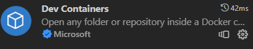

This will allow any local folder to be run in a docker development container and is an easy way to run with a development environment.

Using github desktop, create a new repository named babylonJSdev.  This will be your working space for babylon code development.

> File|New Reppository or CTRL + N

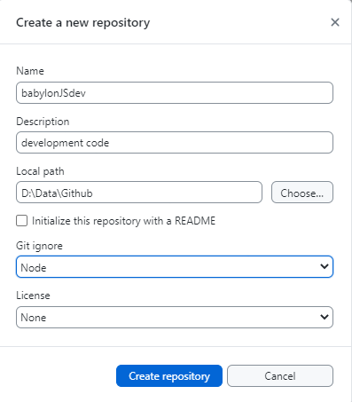

Open this in visual studio code and create a blank file in the folder called dev.md.  You can use this file subsequently to keep notes on your  code development as you go.

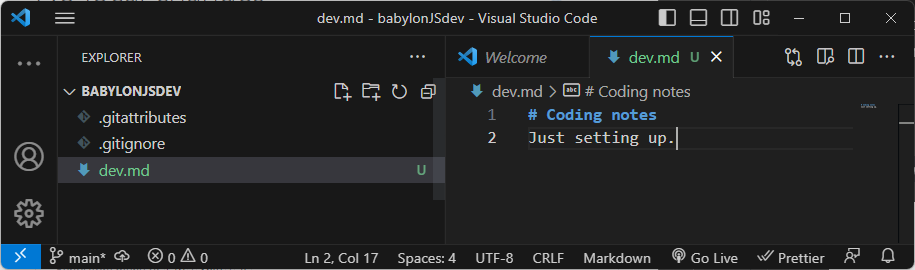

In VScode 

>CRTL + SHIFT + P

to show a list of commands and select open folder in container.

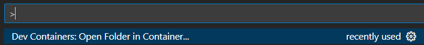

Click on Open Folder in Container. This will then open a browser dialog to choose the devContainer folder and open.

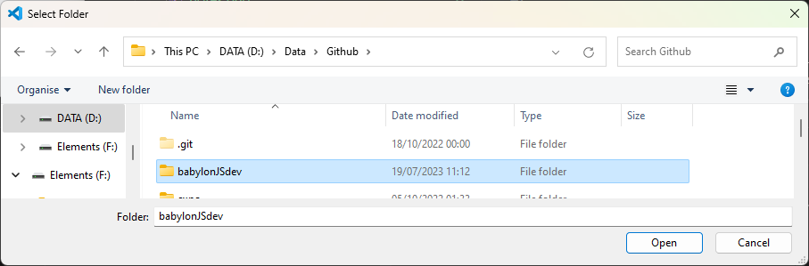

Check that the devcontainer file will be saved in the workspace.  That makes the container easier to transfer to another machine.

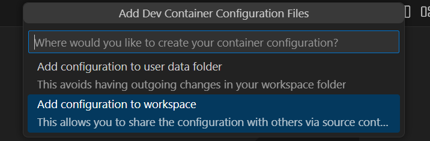

On the first time of opening a prompt appears asking what type of container is needed. Make sure you can see all the options and then choose 'Node & Typescript'

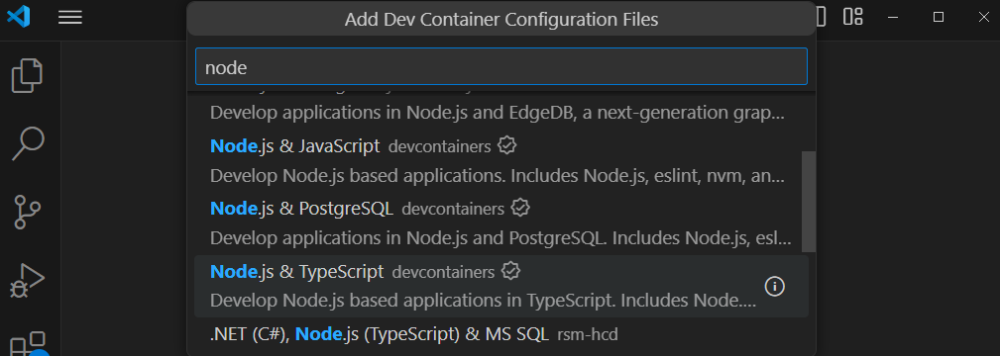

Then you are asked to choose a node version, I have accepted the default version 22-bookworm.

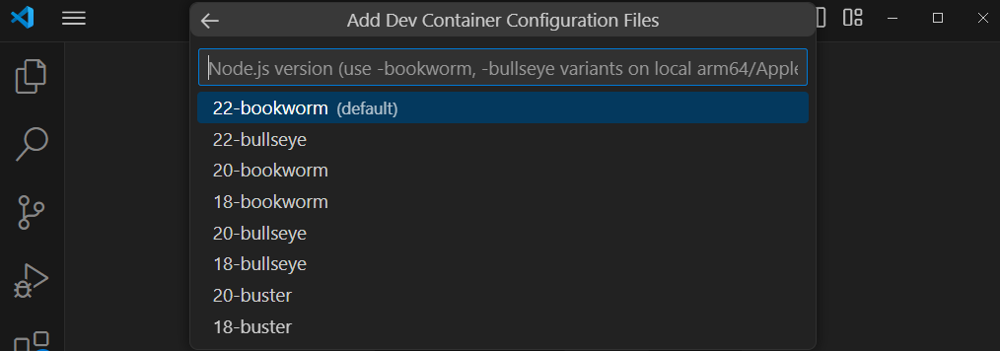


Then you are asked what additional features you need from a large checklist.  I selected none and pressed ok.

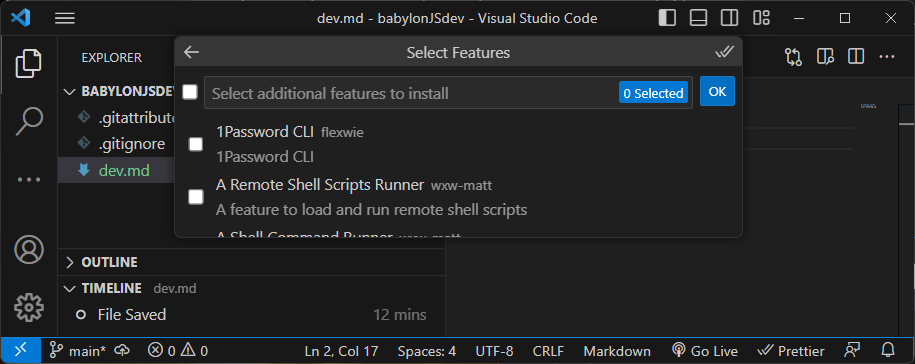

Finally you are offered optional files and I have not added any.
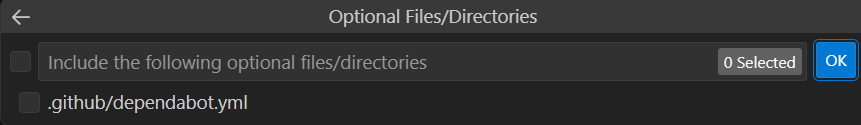

If you are asked to trust a file then do so. The system then takes time to create the container image.  

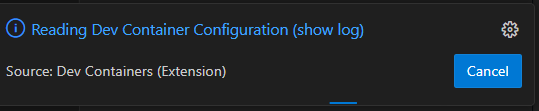

Click on show log to view progress, be patient.

When this is complete docker desktop shows that the container is running.

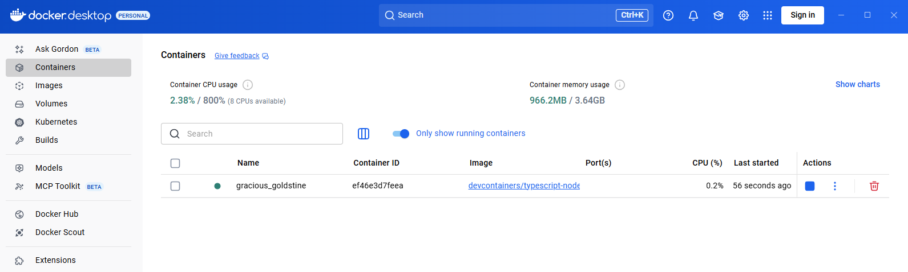

The file structure which has been created in the container is 

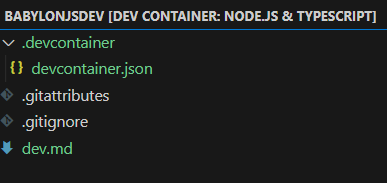

This shows the dev.md file which will be available as a place to keep working notes.

The .devContainer folder contains devcontainer.json which shows that the nature of the container is based on node and typescript.

```json
// For format details, see https://aka.ms/devcontainer.json. For config options, see the
// README at: https://github.com/devcontainers/templates/tree/main/src/typescript-node
{
	"name": "Node.js & TypeScript",
	// Or use a Dockerfile or Docker Compose file. More info: https://containers.dev/guide/dockerfile
	"image": "mcr.microsoft.com/devcontainers/typescript-node:1-22-bookworm"

	// Features to add to the dev container. More info: https://containers.dev/features.
	// "features": {},

	// Use 'forwardPorts' to make a list of ports inside the container available locally.
	// "forwardPorts": [],

	// Use 'postCreateCommand' to run commands after the container is created.
	// "postCreateCommand": "yarn install",

	// Configure tool-specific properties.
	// "customizations": {},

	// Uncomment to connect as root instead. More info: https://aka.ms/dev-containers-non-root.
	// "remoteUser": "root"
}
```
Open a terminal from the VSC menu.  The prompt should appear as

```bash
node ➜ /workspaces/babylonJSdev (main) $ 
```

The node version can be checked by 

>node -v

```bash
v22.20.0
```
If the node version is lower than this by a smalll ammount, say v22.09.0 this should not matter unless you are using very new features.  There is a tool called nvm for node version management which can be used to update node if necessary.

The typescript version is checked by:

>tsc -v

```bash
Version 5.9.0
```
Likewise if this is lower than 5.9.0 it can be updated using npm but this should not be necessary.

Install vite with

>npm install vite

This led to a comment inviting an update to npm.

```bash
added 13 packages in 8s

5 packages are looking for funding
  run `npm fund` for details
npm notice
npm notice New major version of npm available! 10.8.3 -> 11.6.2
npm notice Changelog: https://github.com/npm/cli/releases/tag/v11.6.2
npm notice To update run: npm install -g npm@11.6.2
npm notice
```

Folllow any advice to update.

> npm install -g npm@11.6.2

```bash
added 1 package in 4s

28 packages are looking for funding
  run `npm fund` for details
```

Once the loading process has completed a package.json file is created in the babylonJSdev folder, this displays the dependancy for Vite.

```json
{
  "dependencies": {
    "vite": "^6.4.1"
  }
}
```


Now install babylon core.

>npm i -D @babylonjs/core

```bash
added 2 packages, and audited 16 packages in 25s

5 packages are looking for funding
  run `npm fund` for details

found 0 vulnerabilities
```
and also the inspector to make debugging easier.

>npm i -D @babylonjs/inspector

```bash
added 15 packages, and audited 31 packages in 28s

5 packages are looking for funding
  run `npm fund` for details

found 0 vulnerabilities
```

Also add the babylon loaders required to handle meshes.

>npm i -D @babylonjs/loaders

```bash
up to date, audited 31 packages in 692ms

5 packages are looking for funding
  run `npm fund` for details

found 0 vulnerabilities
```

Finally add the Havok physics engine which is newly introduced to Babylon Version 6 required to handle meshes.

>npm i -D @babylonjs/havok

```bash
added 2 packages, and audited 33 packages in 3s

5 packages are looking for funding
  run `npm fund` for details

found 0 vulnerabilities
```

When these are completed the package.json file will have been modified to show the babylon elements as devDependencies because of the -D flag used on installation.

```JSON
{
  "dependencies": {
    "vite": "^6.4.1"
  },
  "devDependencies": {
    "@babylonjs/core": "^8.33.0",
    "@babylonjs/havok": "^1.3.10",
    "@babylonjs/inspector": "^8.33.0",
    "@babylonjs/loaders": "^8.33.0"
  }
}
```

## Running a test typescript project

To initialise a typescript project based on the vanilla-ts framework vite with a project name testProj

>npm init vite

This asks for permission to add packages:

```bash
Need to install the following packages:
create-vite@6.5.0
Ok to proceed? (y)
```

> Enter y

```bash
? Project name: › vite-project
```

> change to testProj

```bash
│
◆  Project name:
│  testProj█
└
```
Accept the changed name by pressing enter.

```bash
◆  Package name:
│  testproj
```
Accept the package name by pressing enter.

```bash

> Accept testproj

```bash
◆  Select a framework:
│  ● Vanilla
│  ○ Vue
│  ○ React
│  ○ Preact
│  ○ Lit
│  ○ Svelte
│  ○ Solid
│  ...
└
```

> Select vanilla

```bash
◆  Select a variant:
│  ● TypeScript
│  ○ JavaScript
└
```

>Select  typescript

```bash
◇  Scaffolding project in /workspaces/BabylonJSdev/testProj...
│
└  Done. Now run:

  cd testProj
  npm install
  npm run dev
```
> cd testProj

> npm install

```bash
added 14 packages, and audited 15 packages in 6s

5 packages are looking for funding
  run `npm fund` for details

found 0 vulnerabilities
```


This creates a new folder with the name testProj and a starting structure:

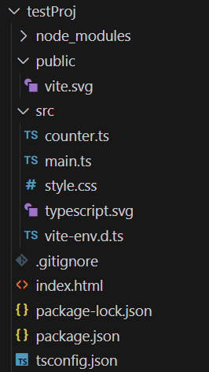

Within the testProj folder is a new package.json file which includes the names of scripts which will allow the project to be run on a development server, built to a distribution folder and for this to be previewed for checking.

**package.json**
```json
{
  "name": "testproj",
  "private": true,
  "version": "0.0.0",
  "type": "module",
  "scripts": {
    "dev": "vite",
    "build": "tsc && vite build",
    "preview": "vite preview"
  },
  "devDependencies": {
    "typescript": "~5.8.3",
    "vite": "^6.3.5"
  }
}
```

Due to changes in the default security settings it is now necessary to add --host to the dev and preview scripts manually thus:
```json
{
  "name": "testproj",
  "private": true,
  "version": "0.0.0",
  "type": "module",
  "scripts": {
    "dev": "vite --host",
    "build": "tsc && vite build",
    "preview": "vite preview --host"
  },
  "devDependencies": {
    "typescript": "~5.8.3",
    "vite": "^6.3.5"
  }
}
```
You wil need to close and re-open VSC to have the changes take effect.

To test this out the dependancies must be installed by the node package manager.

>npm install

```bash
added 1 package, and audited 16 packages in 688ms

5 packages are looking for funding
  run `npm fund` for details

found 0 vulnerabilities
```

>npm run dev

```bash
  VITE v6.4.1  ready in 592 ms

  ➜  Local:   http://localhost:5173/
  ➜  Network: use --host to expose
  ➜  press h + enter to show help
  ```

  Look to the browser 

  >http://127.0.0.1:5173/

  The test project is now running.

  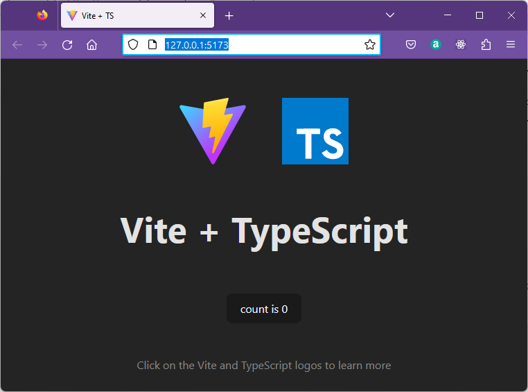

  Clicking on the button will increment the counter.

  The application starts with an HTML file.

  **index.html**
  ```html
<!DOCTYPE html>
<html lang="en">
  <head>
    <meta charset="UTF-8" />
    <link rel="icon" type="image/svg+xml" href="/vite.svg" />
    <meta name="viewport" content="width=device-width, initial-scale=1.0" />
    <title>Vite + TS</title>
  </head>
  <body>
    <div id="app"></div>
    <script type="module" src="/src/main.ts"></script>
  </body>
</html>
  ```

This includes a div with id as 'app' where the javascript will generate output determined by running the typescript file main.ts.

**main.ts**
```javascript
import './style.css'
import typescriptLogo from './typescript.svg'
import viteLogo from '/vite.svg'
import { setupCounter } from './counter.ts'

document.querySelector<HTMLDivElement>('#app')!.innerHTML = `
  <div>
    <a href="https://vitejs.dev" target="_blank">
      
    </a>
    <a href="https://www.typescriptlang.org/" target="_blank">
      
    </a>
    <h1>Vite + TypeScript</h1>
    <div class="card">
      <button id="counter" type="button"></button>
    </div>
    <p class="read-the-docs">
      Click on the Vite and TypeScript logos to learn more
    </p>
  </div>
`

setupCounter(document.querySelector<HTMLButtonElement>('#counter')!)
```

This file first imports a stylesheetand images before importing the function setupCounter from the module file counter.ts.

The output is created by adding to the innerHTML of the #app div.

This includes a button with id 'counter'.

The button is read from the DOM usint the [querySelector](https://www.w3schools.com/jsref/met_document_queryselector.asp) method and passed as a parameter to the setupCounter function.

The counter.ts is a module which exports a single named function.

**counter.ts**
```javascript
export function setupCounter(element: HTMLButtonElement) {
  let counter = 0
  const setCounter = (count: number) => {
    counter = count
    element.innerHTML = `count is ${counter}`
  }
  element.addEventListener('click', () => setCounter(counter + 1))
  setCounter(0)
}
```

The function setupCounter defines a local variable counter with starting value zero and a private function 'setCounter' which will display the count value passed as a parameter to the HTMLButtonElement represented by the parameter 'element'.

An event listener is added to the button which will call setCounter with an incremented value on each click.

setCounter(0) is called to provide a starting value on the button before any clicks are recieved.

This is a typescript app being served by the vite development server.  BabylonJS has not been used yet.

To close the application in the terminal.

>CTRL + C

From gitthub desktop add comments and commit the changes to main.

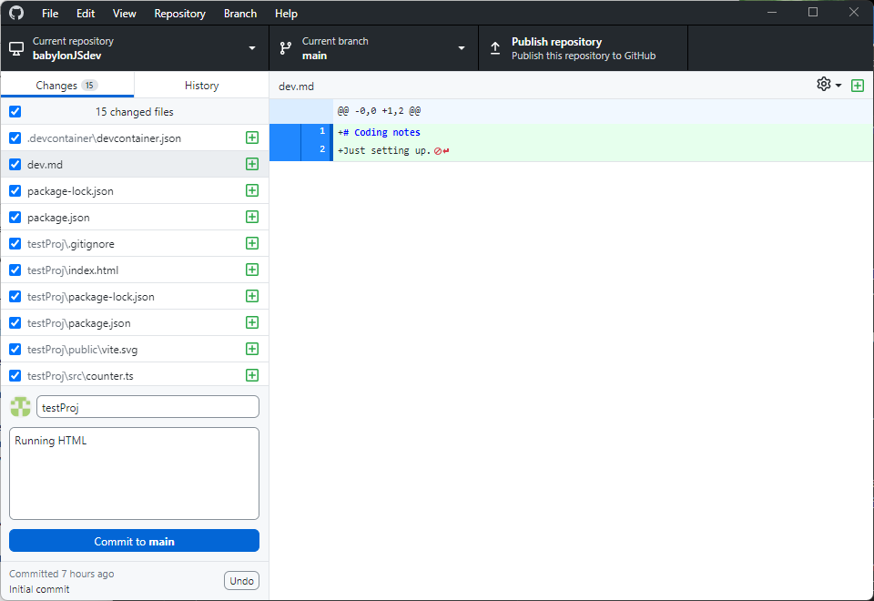

>Commit

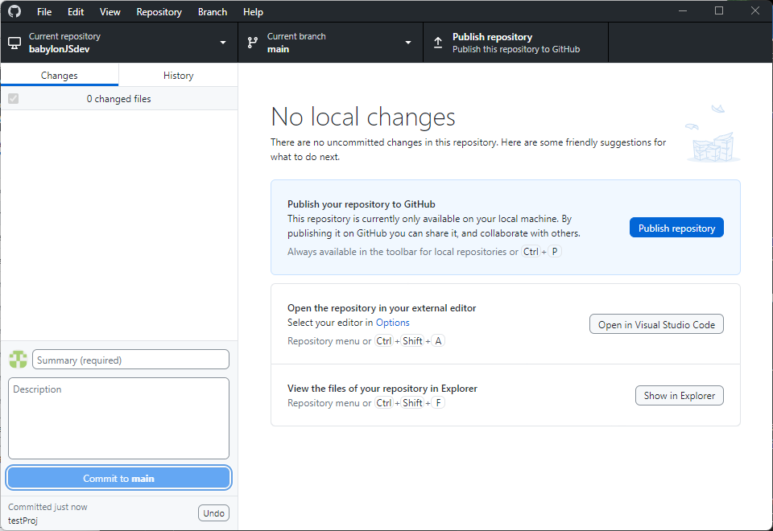

>Publish

Check the repository on gitHub note that all the project files are uploaded, but not the node files because you selected .gitnore node when you created the repository.

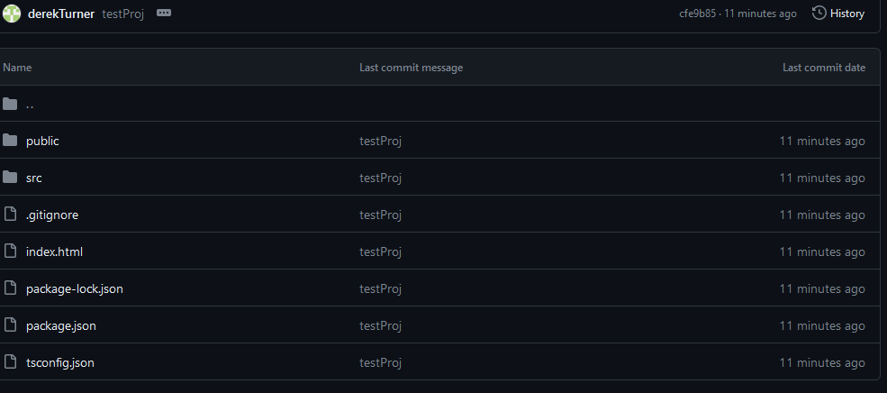
