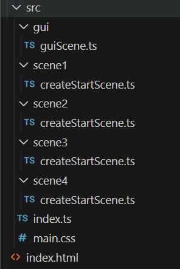
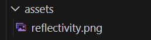

# Multiple scene gui selector

It is often necessary to have multiple scenes in a single application, and this example shows how to do it using the Babylon.js GUI.

This example allows selection between four simple scenes using gui buttons.  It is relatively easy to change the number of scenes. 

The four scenes presented are contained in folders scene1, scene2, scene3, and scene4. Each scene has its own folder and contains the necessary files to run the scene.

The scenes are selected using a gui button. The gui is placed in its own folder which contains the necessary files to run the gui.



Along side the src folder is the assets folder which contains the necessary assets for the scenes.  In this example the assets are kept simple and only a texture is used from the babylonJS assets library.   



## Four basic scenes

For this example the scenes 1-4 are kept simple, just a few basic elements sufficient to identify different scenes. 

**scene1/createStartScene**
```javascript
// import "@babylonjs/core/Debug/debugLayer";
// import "@babylonjs/inspector";
import {
    Scene,
    ArcRotateCamera,
    Vector3,
    HemisphericLight,
    MeshBuilder,
    Mesh,
    Light,
    Camera,
    Engine,
  } from "@babylonjs/core";
  
  
  function createBox(scene: Scene) {
    let box = MeshBuilder.CreateBox("box",{size: 1}, scene);
    box.position.y = 3;
    return box;
  }

  
  function createLight(scene: Scene) {
    const light = new HemisphericLight("light", new Vector3(0, 1, 0), scene);
    light.intensity = 0.7;
    return light;
  }
  
  function createSphere(scene: Scene) {
    let sphere = MeshBuilder.CreateSphere(
      "sphere",
      { diameter: 2, segments: 32 },
      scene,
    );
    sphere.position.y = 1;
    return sphere;
  }
  
  function createGround(scene: Scene) {
    let ground = MeshBuilder.CreateGround(
      "ground",
      { width: 6, height: 6 },
      scene,
    );
    return ground;
  }
  
  function createArcRotateCamera(scene: Scene) {
    let camAlpha = -Math.PI / 2,
      camBeta = Math.PI / 2.5,
      camDist = 10,
      camTarget = new Vector3(0, 0, 0);
    let camera = new ArcRotateCamera(
      "camera1",
      camAlpha,
      camBeta,
      camDist,
      camTarget,
      scene,
    );
    camera.attachControl(true);
    return camera;
  }
  
  export default function createStartScene(engine: Engine) {
    interface SceneData {
      scene: Scene;
      box?: Mesh;
      light?: Light;
      sphere?: Mesh;
      ground?: Mesh;
      camera?: Camera;
    }
  
    let that: SceneData = { scene: new Scene(engine) };
    // that.scene.debugLayer.show();
  
    that.box = createBox(that.scene);
    that.light = createLight(that.scene);
    that.sphere = createSphere(that.scene);
    that.ground = createGround(that.scene);
    that.camera = createArcRotateCamera(that.scene);
    return that;
  }
```

**scene2/createStartScene**
```javascript
// import "@babylonjs/core/Debug/debugLayer";
// import "@babylonjs/inspector";
import {
    Scene,
    ArcRotateCamera,
    Vector3,
    HemisphericLight,
    MeshBuilder,
    Mesh,
    Light,
    Camera,
    Engine,
    StandardMaterial,
    Texture,
    Color3
  } from "@babylonjs/core";
  
  
  function createCylinder(scene: Scene) {
    let cylinder = MeshBuilder.CreateCylinder(
      "cylinder",
      { height: 1, diameter: 0.7 },
      scene
    );
    cylinder.position.x = 1;
    cylinder.position.y = 1;
    cylinder.position.z = 1;
  
    var texture = new StandardMaterial("reflective", scene);
    texture.ambientTexture = new Texture("./assets/reflectivity.png", scene);
    texture.diffuseColor = new Color3(1, 1, 1);
    cylinder.material = texture;
    return cylinder;
  }

  
  function createLight(scene: Scene) {
    const light = new HemisphericLight("light", new Vector3(0, 1, 0), scene);
    light.intensity = 0.7;
    return light;
  }
  
  function createSphere(scene: Scene) {
    let sphere = MeshBuilder.CreateSphere(
      "sphere",
      { diameter: 2, segments: 32 },
      scene,
    );
    sphere.position.y = 1;
    return sphere;
  }
  
  function createGround(scene: Scene) {
    let ground = MeshBuilder.CreateGround(
      "ground",
      { width: 6, height: 6 },
      scene,
    );
    return ground;
  }
  
  function createArcRotateCamera(scene: Scene) {
    let camAlpha = -Math.PI / 2,
      camBeta = Math.PI / 2.5,
      camDist = 10,
      camTarget = new Vector3(0, 0, 0);
    let camera = new ArcRotateCamera(
      "camera1",
      camAlpha,
      camBeta,
      camDist,
      camTarget,
      scene,
    );
    camera.attachControl(true);
    return camera;
  }
  
  export default function createStartScene(engine: Engine) {
    interface SceneData {
      scene: Scene;
      cylinder?: Mesh;
      light?: Light;
      sphere?: Mesh;
      ground?: Mesh;
      camera?: Camera;
    }
  
    let that: SceneData = { scene: new Scene(engine) };
    // that.scene.debugLayer.show();
  
    that.cylinder = createCylinder(that.scene);
    that.light = createLight(that.scene);
    that.sphere = createSphere(that.scene);
    that.ground = createGround(that.scene);
    that.camera = createArcRotateCamera(that.scene);
    return that;
  }
```

**scene3/createStartScene**
```javascript
// import "@babylonjs/core/Debug/debugLayer";
// import "@babylonjs/inspector";
import {
    Scene,
    ArcRotateCamera,
    Vector3,
    HemisphericLight,
    MeshBuilder,
    Mesh,
    Light,
    Camera,
    Engine,
    Texture,
    StandardMaterial,
    Color3
  } from "@babylonjs/core";
  
  
  function createTorus(scene: Scene) {
    let torus = MeshBuilder.CreateTorus(
      "torus",
      { diameter: 0.7, thickness: 0.6, tessellation: 10 },
      scene
    );
    torus.position.x = -1;
    torus.position.y = 2;
    torus.position.z = 1;
  
    var texture = new StandardMaterial("reflective", scene);
    texture.ambientTexture = new Texture("./assets/reflectivity.png", scene);
    texture.diffuseColor = new Color3(1, 1, 1);
    torus.material = texture;

    return torus;
  }

  
  function createLight(scene: Scene) {
    const light = new HemisphericLight("light", new Vector3(0, 1, 0), scene);
    light.intensity = 0.7;
    return light;
  }
  
  function createSphere(scene: Scene) {
    let sphere = MeshBuilder.CreateSphere(
      "sphere",
      { diameter: 2, segments: 32 },
      scene,
    );
    sphere.position.y = 1;
    return sphere;
  }
  
  function createGround(scene: Scene) {
    let ground = MeshBuilder.CreateGround(
      "ground",
      { width: 6, height: 6 },
      scene,
    );
    return ground;
  }
  
  function createArcRotateCamera(scene: Scene) {
    let camAlpha = -Math.PI / 2,
      camBeta = Math.PI / 2.5,
      camDist = 10,
      camTarget = new Vector3(0, 0, 0);
    let camera = new ArcRotateCamera(
      "camera1",
      camAlpha,
      camBeta,
      camDist,
      camTarget,
      scene,
    );
    camera.attachControl(true);
    return camera;
  }
  
  export default function createStartScene(engine: Engine) {
    interface SceneData {
      scene: Scene;
      torus?: Mesh;
      light?: Light;
      sphere?: Mesh;
      ground?: Mesh;
      camera?: Camera;
    }
  
    let that: SceneData = { scene: new Scene(engine) };
    // that.scene.debugLayer.show();
  
    that.torus = createTorus(that.scene);
    that.light = createLight(that.scene);
    that.sphere = createSphere(that.scene);
    that.ground = createGround(that.scene);
    that.camera = createArcRotateCamera(that.scene);
    return that;
  }
```

**scene4/createStartScene**
```javascript
// import "@babylonjs/core/Debug/debugLayer";
// import "@babylonjs/inspector";
import {
    Scene,
    ArcRotateCamera,
    Vector3,
    HemisphericLight,
    MeshBuilder,
    Mesh,
    Light,
    Camera,
    Engine,
    Texture,
    StandardMaterial,
    Color3
  } from "@babylonjs/core";
  
  
  function createTube(scene: Scene) {
    const myPath = [
      new Vector3(1.85, 0.85, 0.85),
      new Vector3(1.35, 0.35, 0.35),
    ];
  
    const tube = MeshBuilder.CreateTube(
      "tube",
      { path: myPath, radius: 0.4, sideOrientation: Mesh.DOUBLESIDE },
      scene
    );
  
    var texture = new StandardMaterial("reflective", scene);
    texture.ambientTexture = new Texture("./assets/reflectivity.png", scene);
    texture.diffuseColor = new Color3(1, 1, 1);
    tube.material = texture;
    return tube;
  }

  
  function createLight(scene: Scene) {
    const light = new HemisphericLight("light", new Vector3(0, 1, 0), scene);
    light.intensity = 0.7;
    return light;
  }
  
  function createSphere(scene: Scene) {
    let sphere = MeshBuilder.CreateSphere(
      "sphere",
      { diameter: 2, segments: 32 },
      scene,
    );
    sphere.position.y = 1;
    return sphere;
  }
  
  function createGround(scene: Scene) {
    let ground = MeshBuilder.CreateGround(
      "ground",
      { width: 6, height: 6 },
      scene,
    );
    return ground;
  }
  
  function createArcRotateCamera(scene: Scene) {
    let camAlpha = -Math.PI / 2,
      camBeta = Math.PI / 2.5,
      camDist = 10,
      camTarget = new Vector3(0, 0, 0);
    let camera = new ArcRotateCamera(
      "camera1",
      camAlpha,
      camBeta,
      camDist,
      camTarget,
      scene,
    );
    camera.attachControl(true);
    return camera;
  }
  
  export default function createStartScene(engine: Engine) {
    interface SceneData {
      scene: Scene;
      tube?: Mesh;
      light?: Light;
      sphere?: Mesh;
      ground?: Mesh;
      camera?: Camera;
    }
  
    let that: SceneData = { scene: new Scene(engine) };
    // that.scene.debugLayer.show();
  
    that.tube = createTube(that.scene);
    that.light = createLight(that.scene);
    that.sphere = createSphere(that.scene);
    that.ground = createGround(that.scene);
    that.camera = createArcRotateCamera(that.scene);
    return that;
  }
```

## The Gui

The Gui is a separate scene that is rendered on top of the main scene. It is used to display the controls for the main scene.

The first items in guiScene.js are the imports.  These include a setSceneIndex function which has not been written yet, but will be used to switch between scenes.

The Sound elements in this scene have been temporarily removed as they relate to the previous sound engine which is no longer in use.

**guiScene.js (extract)**
```javascript
import setSceneIndex from "./../index";

import {
    Scene,
    ArcRotateCamera,
    Vector3,
    Camera,
    Engine,
  
    Sound
  } from "@babylonjs/core";
  import * as GUI from "@babylonjs/gui";
 
  //----------------------------------------------------
  ```

  The function createSceneButton is used to create labelled buttons on the gui.  The text for display is passed as a string parameter and button is placed on the advanced dynamic texture.

  The button action is provided by adding an onPointerUpObservable function which will act when the mouse button is released over the button.  This calls the imported setSceneIndex function to change the scene.  Note that the setSceneIndex function is called with the index -1 because the scenes are 0 based.

**guiScene.js (extract)**
```javascript
  function createSceneButton(scene: Scene, name: string, note: string, index: number, x: string, y: string, advtex: GUI.AdvancedDynamicTexture) {
    let button = GUI.Button.CreateSimpleButton(name, note);
        button.left = x;
        button.top = y;
        button.width = "80px";
        button.height = "30px";
        button.color = "white";
        button.cornerRadius = 20;
        button.background = "purple";


        button.onPointerUpObservable.add(function() {
            console.log("THE BUTTON HAS BEEN CLICKED");
            setSceneIndex(index -1);
        });
        advtex.addControl(button);
        return button;
 }
 ``` 

The guiScene needs a camera to be created and added to the scene.  This camera is used to render the gui scene and is not used for the main scene.  The camera is set up to be a static camera and does not need controls added.  The camera is added to the scene with the attachControl function set to false so that it does not respond to mouse or touch events.

Each of the scenes has an independent camera so changing the scene view will restore the position of the camera to the position it was in when the scene last displayed.

**guiScene.js (extract)**
```javascript
 function createArcRotateCamera(scene: Scene) {
  let camAlpha = -Math.PI / 2,
    camBeta = Math.PI / 2.5,
    camDist = 10,
    camTarget = new Vector3(0, 0, 0);
  let camera = new ArcRotateCamera(
    "camera1",
    camAlpha,
    camBeta,
    camDist,
    camTarget,
    scene,
  );
  camera.attachControl(false);
  return camera;
}
```

The guiScene is created by calling the menuScene function which is the default export of the guiScene.js file.

**guiScene.js(extract)**
```javascript
  export default function menuScene(engine: Engine) {
    interface SceneData {
      scene: Scene;
      advancedTexture: GUI.AdvancedDynamicTexture;
      button1: GUI.Button;
      button2: GUI.Button;
      button3: GUI.Button;
      button4: GUI.Button;
      camera: Camera;
    }
  
    let scene = new Scene(engine);
    let advancedTexture = GUI.AdvancedDynamicTexture.CreateFullscreenUI("myUI", true);
    var button1 = createSceneButton(scene,"but1", "1",1,"-150px", "120px", advancedTexture);
    var button2 = createSceneButton(scene,"but2", "2", 2,"-50px", "120px", advancedTexture);
    var button3 = createSceneButton(scene,"but3", "3",3,"50px", "120px", advancedTexture);
    var button4 = createSceneButton(scene,"but4", "4", 4,"150px", "120px", advancedTexture);
    var camera = createArcRotateCamera(scene);

 
    let that: SceneData = {
      scene,
      advancedTexture,
      button1,
      button2,
      button3,
      button4,
      camera
    };
    
    return that;
  } 
```

## Other files

The **index.html** file is linked to **index.js** in the normal way and only needs a title change for use.

**index.html**
```html
<!DOCTYPE html>
<html>
    <head>
        <meta charset="UTF-8">
        <title>Multiple Scenes</title>
    </head>
    <body> </body>
</html>
<script type="module" src="./src/index.ts"></script>
```
The **index.js** file is the entry point for the application. It is responsible for creating the canvas and engine, and then calling the setSceneIndex() function to choose the initial screen to display.  Index.js acs as an aggregator page to draw the scenes and gui together and render them.


This imports the scene related elements from other modules, including the stylesheet in main,css.

The canvas is created and appended to the document body.

The scenes are added into an array of scenes.

The current scene is set to scenes[0] and the setSceneIndes is set to 0.

The setSceneIndex function is exported so that it can be called from within the guiScene.js file to change the scene when a button is pressed.

As the gui scene is made up buttons are added with labels 1,2,3, but the call to the scenes array is adjusted to use index 0,1,2.

**index.ts**
```javascript
import { Engine} from "@babylonjs/core";
import createScene1  from "./scene1/createStartScene";
import createScene2  from "./scene2/createStartScene";
import createScene3  from "./scene3/createStartScene";
import createScene4  from "./scene4/createStartScene";
import menuScene from "./gui/guiScene";
import "./main.css";

const CanvasName = "renderCanvas";

let canvas = document.createElement("canvas");
canvas.id = CanvasName;

canvas.classList.add("background-canvas");
document.body.appendChild(canvas);

let scene;
let scenes: any[] = [];

let eng = new Engine(canvas, true, {}, true);
let gui = menuScene(eng);
scenes[0] = createScene1(eng);
scenes[1] = createScene2(eng);
scenes[2] = createScene3(eng);
scenes[3] = createScene4(eng);
scene = scenes[0].scene;
setSceneIndex(0);

export default function setSceneIndex(i: number) {
  eng.runRenderLoop(() => {
      scenes[i].scene.render();
      gui.scene.autoClear = false;
      gui.scene.render();
  });
}   
```

## Running the example

This will appear on the browser as:


<iframe 
    height="350" 
    width="100%" 
    scrolling="no" 
    title="Gui scenes selector" 
    src="Block_3/section_10/multiBuild/index.html" 
    frameborder="no" 
    loading="lazy" 
    allowtransparency="true" 
    allowfullscreen="true">
</iframe>

